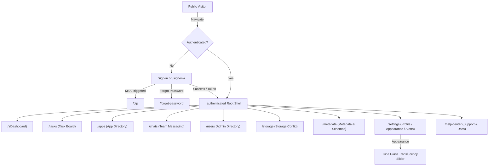

# Route & Screen Architecture: Console (`@unipost/console`)
> **Routing Engine:** TanStack Router (`@tanstack/react-router` v1)  
> **Layout Shell:** Authenticated Frosted Rail Shell (`_authenticated`)  
> **Status:** Living Document & Foundation Specification

---

## 1. Routing Engine & Navigation Architecture

### 1.1 Overview
The `@unipost/console` web and desktop application utilizes **TanStack Router** with file-based route tree generation in `src/routes/`. The application is architected around two primary route layout structures:
1. **Unauthenticated Boundary (`(auth)`)**: Focused authentication flows centered on clean glass card forms over an ambient mesh canvas.
2. **Authenticated Operational Shell (`_authenticated`)**: Persistent frosted navigation rail (`AppSidebar`), sticky frosted top header (`Header`), breadcrumb trail, command search dialog (`SearchCommand`), and dynamic main content view.
3. **Error Boundaries (`(errors)` and `_authenticated/errors`)**: Fallback screens for 401, 403, 404, 500, and 503 exceptions.

### 1.2 Layout Tree Hierarchy

```
src/routes/
├── __root.tsx                                  # Global root: Providers, Toaster, Devtools
├── (auth)/                                     # Unauthenticated Layout Group
│   ├── sign-in.tsx                             # Single-column glass sign-in
│   ├── sign-in-2.tsx                           # Two-column split sign-in with graphic
│   ├── sign-up.tsx                             # User registration
│   ├── forgot-password.tsx                     # Password recovery
│   └── otp.tsx                                 # Multi-factor OTP code entry
├── (errors)/                                   # Unauthenticated Error Pages
│   ├── 401.tsx / 403.tsx / 404.tsx / 500.tsx / 503.tsx
└── _authenticated/                             # Authenticated Layout Shell
    ├── route.tsx                               # Shell wrapper (Sidebar + Top Bar + Outlet)
    ├── index.tsx                               # Path: "/" -> Dashboard
    ├── tasks/index.tsx                         # Path: "/tasks" -> Task management
    ├── apps/index.tsx                          # Path: "/apps" -> App integrations
    ├── chats/index.tsx                         # Path: "/chats" -> Messaging workspace
    ├── users/index.tsx                         # Path: "/users" -> Admin user directory
    ├── storage/index.tsx                       # Path: "/storage" -> Storage provider setup
    ├── settings/
    │   ├── route.tsx                           # Settings sub-layout with inner tab nav
    │   ├── index.tsx                           # Path: "/settings" -> Profile
    │   ├── appearance.tsx                      # Path: "/settings/appearance"
    │   └── notifications.tsx                   # Path: "/settings/notifications"
    ├── help-center/index.tsx                   # Path: "/help-center"
    └── errors/$error.tsx                       # Dynamic internal error boundary
```

---

## 2. Route Registry Matrix

| Route Path | File Location | Auth Required | Layout Shell | Primary User Action / Feature |
| :--- | :--- | :--- | :--- | :--- |
| `/` | `_authenticated/index.tsx` | Yes | Authenticated Shell | System health telemetry, quick stats, operational overview |
| `/tasks` | `_authenticated/tasks/index.tsx` | Yes | Authenticated Shell | Manage backlog tasks, filter priority, update status |
| `/apps` | `_authenticated/apps/index.tsx` | Yes | Authenticated Shell | Browse connected services, toggle integrations |
| `/chats` | `_authenticated/chats/index.tsx` | Yes | Authenticated Shell | Direct and channel messaging with team members |
| `/users` | `_authenticated/users/index.tsx` | Yes (Admin) | Authenticated Shell | User directory CRUD, role assignments, invite links |
| `/storage` | `_authenticated/storage/index.tsx` | Yes (Admin) | Authenticated Shell | Configure S3/MinIO buckets, test connectivity, view usage |
| `/metadata` | `_authenticated/metadata/index.tsx` | Yes (Admin) | Authenticated Shell | Enterprise schema builder, dynamic attribute configurator, data records explorer |
| `/settings` | `_authenticated/settings/index.tsx` | Yes | Settings Layout | Manage account name, email, avatar, bio |
| `/settings/appearance` | `_authenticated/settings/appearance.tsx`| Yes | Settings Layout | Switch theme (light/dark/system), adjust glass intensity |
| `/settings/notifications`| `_authenticated/settings/notifications.tsx`| Yes | Settings Layout | Configure email, push, and webhook alerts |
| `/settings/data-privacy` | `_authenticated/settings/data-privacy.tsx` | Yes | Settings Layout | GDPR Art. 20 streaming export & Art. 17 hard-purge |
| `/help-center` | `_authenticated/help-center/index.tsx` | Yes | Authenticated Shell | Browse docs, search FAQs, submit support tickets |
| `/sign-in` | `(auth)/sign-in.tsx` | No | Fullscreen Canvas | Authenticate with credentials or OAuth |
| `/sign-in-2` | `(auth)/sign-in-2.tsx` | No | Split Screen Canvas | Two-column branded sign-in |
| `/sign-up` | `(auth)/sign-up.tsx` | No | Fullscreen Canvas | Register new user account |
| `/forgot-password`| `(auth)/forgot-password.tsx` | No | Fullscreen Canvas | Request password reset magic link |
| `/otp` | `(auth)/otp.tsx` | No | Fullscreen Canvas | 6-digit MFA verification |

---

## 3. Detailed Screen Blueprints

### 3.1 Dashboard (`/`)
- **Route:** `src/routes/_authenticated/index.tsx`
- **Component Stack:** `DashboardOverview`, `OverviewCards`, `TelemetryAreaChart`, `RecentAuditsTable`.
- **Layout:** Responsive 12-column grid (`grid-cols-1 md:grid-cols-2 lg:grid-cols-4`).
- **Glass Spec:**
  - KPI Metric Cards: `bg-white/45 dark:bg-slate-900/45 backdrop-blur-xl border border-white/30 dark:border-white/10 rounded-2xl p-5`.
  - Chart Container: Double-width glass card spanning 8 columns on desktop.
- **State & Stores:** Fetches dashboard telemetry via `@tanstack/react-query`; auto-refresh interval configurable.

### 3.2 Task Management (`/tasks`)
- **Route:** `src/routes/_authenticated/tasks/index.tsx`
- **Component Stack:** `DataTable`, `DataTableToolbar`, `DataTableRowActions`, `CreateTaskDialog`.
- **URL Query Sync:** `useTableUrlState` tracks `page`, `per_page`, `sort`, `filter` in URL search params.
- **Features:** Multi-column sorting, facet filtering by status and priority, inline status mutation.

### 3.3 Connected Apps (`/apps`)
- **Route:** `src/routes/_authenticated/apps/index.tsx`
- **Component Stack:** `AppCardGrid`, `AppFilterHeader`, `ConnectIntegrationModal`.
- **Layout:** Responsive 3-column card grid (`grid-cols-1 md:grid-cols-2 lg:grid-cols-3 gap-6`).
- **Features:** Search integration by name/category; toggle switch inside glass card footer.

### 3.4 Messaging & Chats (`/chats`)
- **Route:** `src/routes/_authenticated/chats/index.tsx`
- **Layout:** Split-pane interface (`w-80` channel/direct message list + flex-1 active chat thread).
- **Glass Spec:** Left thread panel with `backdrop-blur-md`, main message bubble stream with distinct sender/receiver frosted fills.

### 3.5 User Administration (`/users`)
- **Route:** `src/routes/_authenticated/users/index.tsx`
- **Features:** Server-side paginated user table, invite modal with role dropdown (Admin, Member, Viewer), suspend/delete action dialogs.

### 3.6 Storage Providers (`/storage`)
- **Route:** `src/routes/_authenticated/storage/index.tsx`
- **Features:** Overview of connected buckets, test connection ping, storage capacity meter, credential secret input fields.

### 3.7 Settings Suite (`/settings/*`)
- **Route:** `src/routes/_authenticated/settings/route.tsx`
- **Sub-routes:**
  - `/settings`: Profile details, bio, avatar upload.
  - `/settings/appearance`: Theme switcher (Light, Dark, System) and **Liquid Glass Intensity Slider** (`0.0` - `1.0`).
  - `/settings/notifications`: Toggle switches for email digests, incident webhooks, real-time sounds.

### 3.8 Metadata Management (`/metadata`)
- **Route:** `src/routes/_authenticated/metadata/index.tsx`
- **Component Stack:** `MetadataFeature`, `EntityTypeSidebar`, `SchemaBuilder`, `EntityDataGrid`, `AttributeDialog`, `RecordEditorDialog`, `SchemaJsonPreview`.
- **Layout:** Liquid Glass split-view (`lg:w-72` frosted entity model rail + flex-1 active model workspace).
- **Glass Spec:** Multi-layer frosted translucent cards (`backdrop-blur-xl bg-white/45 dark:bg-slate-900/45 border border-white/30 dark:border-white/10 shadow-lg`), frosted tab triggers, and monospace key tags.
- **State & Stores:** `useMetadataUiStore` tracks active entity selection, view tab (`schema` | `data`), search filter, and dialogs. TanStack Query caching backed by `springApiClient` with sandbox fallback.
- **Features:** 9 UI component types, auto-slugging system keys, live Draft-07 JSON Schema compiler, dynamic Zod validation, record pagination and JSON export.

---

## 4. User Navigation Flow



---

## 5. Adding New Routes (Developer & Agent Playbook)

When adding a new feature screen to `@unipost/console`:
1. **Create Route File:** Add `src/routes/_authenticated/<feature>/index.tsx`.
2. **Define TanStack Route:** Export `Route = createFileRoute('/_authenticated/<feature>/')({ component: FeaturePage })`.
3. **Register Navigation:** Add the nav item in `src/components/layout/data/sidebar-data.ts`.
4. **Synchronize Locales:** Add matching translation keys to `packages/i18n/src/locales/{en,vi}/common.json` and `apps/console/src/locales/{en,vi}/console.json`.
5. **Update ROUTE.md:** Add row to Section 2 Matrix and screen blueprint in Section 3.
