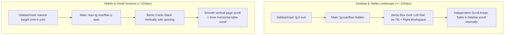

# Implementation Plan 58 - Mobile Viewport Overflow Scroll & Bento Box Responsive Preservation

## Executive Summary

When implementing the Bento Box layout for the Metadata Management module and related workspace features in `@unipost/console` (`apps/console`), fixed viewport constraints (`has-data-[layout=fixed]:h-svh` and `<Main fixed>` with `overflow-hidden`) were introduced to achieve an IDE-style desktop workspace with independent internal pane scrolling.

On small screens (mobile viewports), this causes a complete lock of vertical scrolling because stacked layout items exceed `100svh`, yet the outer containers forcefully prevent scrolling. This document outlines the architectural root cause, system invariants, brainstormed approaches, and the concrete implementation plan to unlock fluid mobile scrolling without breaking the desktop Bento Box experience on medium and large screens.

---

## 1. Problem Statement & Root Cause

### 1.1 Root Cause Breakdown
1. **Unconditional `100svh` Height Clamping**:
   - In [`AuthenticatedLayout`](file:///c:/Users/Admin/workspace/git/unipost/apps/console/src/components/layout/authenticated-layout.tsx#L27-L35):
     ```tsx
     <SidebarInset
       className={cn(
         '@container/content',
         'has-data-[layout=fixed]:h-svh',
         'peer-data-[variant=inset]:has-data-[layout=fixed]:h-[calc(100svh-(var(--spacing)*4))]'
       )}
     >
     ```
   - Clamps the container height on all viewports, including mobile devices, whenever `<Main fixed>` is present.
2. **Rigid `overflow-hidden` on Main Container**:
   - In [`Main`](file:///c:/Users/Admin/workspace/git/unipost/apps/console/src/components/layout/main.tsx#L16-L18):
     ```tsx
     fixed && 'flex grow flex-col overflow-hidden'
     ```
   - Prevents the `<main>` container from overflowing or scrolling vertically.
3. **Vertical Stacking of Bento Box Panes on Mobile**:
   - In [`MetadataFeature`](file:///c:/Users/Admin/workspace/git/unipost/apps/console/src/features/metadata/components/metadata-feature.tsx#L111):
     ```tsx
     <div className="flex flex-col lg:flex-row gap-6 items-stretch flex-1 w-full min-w-0 min-h-0">
     ```
   - On `< lg`, `EntityTypeSidebar` (~350px) stacks above the Active Model Banner (~120px), which stacks above the `EntityDataGrid` or `SchemaBuilder`.
   - Total height exceeds `800px – 1400px+`, trapping lower components off-screen with zero scroll capability.

---

## 2. Invariants & Requirements

* **MEDIUM & LARGE SCREENS (`≥ lg` / `≥ 1024px`)**:
  - MUST preserve the Bento Box layout.
  - MUST retain `100svh` height clamping, frozen table headers, pinned toolbars, and independent pane scrollbars (`min-h-0 overflow-y-auto`).
  - Specular glass borders, blur tokens, and elevation shadows must remain unchanged.
* **SMALL SCREENS (`< lg` / Mobile Viewport)**:
  - MUST allow natural vertical scrolling for the page.
  - Container height MUST be unlocked (`h-auto` / `min-h-full`).
  - Table and tab navigation MUST support inner horizontal touch scrolling (`overflow-x-auto`) without causing page-wide horizontal blowout.
* **REGRESSION PREVENTION**:
  - Existing routes using `<Main fixed>` (`apps`, `chats`, `settings`, `storage`, `metadata`) must continue functioning seamlessly across all screen sizes.

---

## 3. Brainstorming: Evaluated Options

| Approach | Description | Pros | Cons | Recommendation |
| :--- | :--- | :--- | :--- | :--- |
| **Option A: Global Responsive Breakpoint in Layout Primitives** | Scope `has-data-[layout=fixed]:h-svh` and `overflow-hidden` to `lg:` in `authenticated-layout.tsx` and `main.tsx`. | Minimal diff; fixes all fixed screens instantly; zero breakage on desktop. | Mobile views that need pinned layout (like mobile chat) lose full-height clamping unless customized. | **Accepted for foundation** |
| **Option B: Parametric `fixed` Prop** | Update `Main` to accept `fixed?: boolean | 'desktop' | 'always'`. | Granular per-screen control. | Requires updating multiple route callsites. | **Complementary** |
| **Option C: Bento Mobile Ergonomics** | On mobile, adapt `EntityTypeSidebar` into a collapsible drawer/select and preserve full grid usability. | Maximizes mobile UX and prevents excessive vertical scroll distance. | Higher implementation scope. | **Recommended for Phase 2** |

---

## 4. Proposed Technical Solution

### Phase 1: Core Layout Primitives (Zero Desktop Regression)

1. **Update [`AuthenticatedLayout`](file:///c:/Users/Admin/workspace/git/unipost/apps/console/src/components/layout/authenticated-layout.tsx)**:
   - Scope the fixed height rule to desktop (`lg:` breakpoint):
   ```tsx
   <SidebarInset
     className={cn(
       '@container/content',
       // Only clamp height on desktop viewports (lg and above):
       'lg:has-data-[layout=fixed]:h-svh',
       'peer-data-[variant=inset]:lg:has-data-[layout=fixed]:h-[calc(100svh-(var(--spacing)*4))]'
     )}
   >
   ```

2. **Update [`Main`](file:///c:/Users/Admin/workspace/git/unipost/apps/console/src/components/layout/main.tsx)**:
   - Allow natural vertical overflow on mobile while preserving `overflow-hidden` on desktop:
   ```tsx
   export function Main({ fixed, className, fluid, ...props }: MainProps) {
     return (
       <main
         data-layout={fixed ? 'fixed' : 'auto'}
         className={cn(
           'px-4 py-6',
           // Pinned on desktop, scrollable on mobile:
           fixed && 'flex grow flex-col max-lg:min-h-0 max-lg:overflow-y-auto lg:overflow-hidden',
           !fluid && '@7xl/content:mx-auto @7xl/content:w-full @7xl/content:max-w-7xl',
           className
         )}
         {...props}
       />
     )
   }
   ```

### Phase 2: Metadata Feature Bento Adaptation

1. **[`MetadataFeature`](file:///c:/Users/Admin/workspace/git/unipost/apps/console/src/features/metadata/components/metadata-feature.tsx)**:
   - Ensure the outer flex container (`flex flex-col lg:flex-row gap-6 items-stretch flex-1 w-full min-w-0 min-h-0`) allows flex children to expand naturally on `< lg` without vertical collapse.
   - Adjust `min-h-0` to `max-lg:min-h-fit lg:min-h-0` so child cards do not collapse their content on small screens.
2. **[`EntityDataGrid`](file:///c:/Users/Admin/workspace/git/unipost/apps/console/src/features/metadata/components/data-explorer/entity-data-grid.tsx)**:
   - Give the table container a resilient minimum height on mobile (`min-h-[400px] md:min-h-[500px] lg:min-h-0`) so touch scrolling on rows functions cleanly.
   - Keep horizontal overflow (`overflow-x-auto`) for wide data columns with the sticky action column intact.
3. **[`Settings`](file:///c:/Users/Admin/workspace/git/unipost/apps/console/src/features/settings/index.tsx)**:
   - Relax `overflow-hidden` and `overflow-y-hidden` on mobile to `lg:overflow-hidden` so settings sub-forms can be scrolled and saved.

---

## 5. Visual Architecture Flow



---

## 6. Verification & Test Plan

1. **Desktop Verification (`>= 1024px`)**:
   - Inspect Metadata Management, Settings, Storage, and Apps.
   - Confirm viewport remains pinned at `100svh`.
   - Confirm table headers remain sticky on vertical scroll inside the data grid.
   - Confirm Bento box cards maintain identical glass borders and layout proportions.
2. **Mobile Viewport Verification (`375px` to `768px`)**:
   - Switch DevTools to iPhone/Android mobile viewports.
   - Verify vertical scrolling is fully functional from top navigation down to the bottom pagination controls.
   - Verify table scrolls horizontally without expanding the entire page body.
   - Verify Settings form inputs and buttons can be scrolled into view and clicked.
3. **Automated Build & Lint Check**:
   - Run `pnpm --filter @unipost/console check-types` and `pnpm --filter @unipost/console build`.
