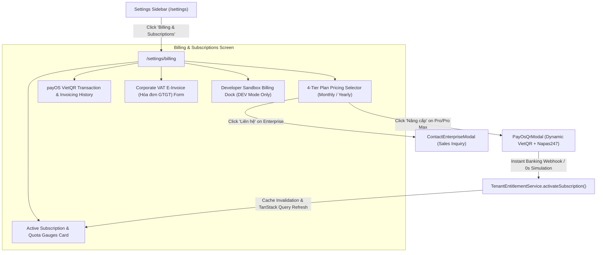

# Implementation Plan 68: Settings Billing & Subscriptions Screen

A dedicated, enterprise-grade **Billing & Subscriptions** management screen (`/settings/billing`) in `@unipost/console` adhering to the **Tenant-Workspace Domain Hierarchy**, **Liquid Glass UI System**, and **Vietnamese Domestic Enterprise Standards (VietQR / Napas247 / E-Invoice)**.

---

## 1. Domain Context & Subscription Tier Hierarchy

### 1.1 Tenant vs. Workspace FinOps Boundary
In Unipost's architecture:
- **Tenant (Organization or Individual)**: The root billing entity, PostgreSQL RLS domain owner, and subscription holder. All feature entitlements (`FEATURE_*`) and quotas belong to the Tenant.
- **Workspaces (Environments / Branches)**: Child sub-partitions within a Tenant (e.g. Production, Staging, Kho Bắc). Workspaces inherit the parent Tenant's plan and feature tokens.

### 1.2 Standardized 4-Tier Subscription Catalog
Per user requirements, subscriptions are categorized and labeled as:
1. **Basic (individual)**:
   - Price: 0 ₫ (Miễn phí)
   - Scope: Cá nhân khởi đầu
   - Quotas: 1 Workspace, 5 Entity Schemas, Không giới hạn Records
   - Entitlements: `FEATURE_METADATA_READ`, `FEATURE_RECORDS_CRUD`, Community Support
2. **Pro (individual)**:
   - Price: 199,000 ₫ / tháng (hoặc 1,990,000 ₫ / năm — Tiết kiệm 20%)
   - Scope: Chuyên gia & Nhà phát triển cá nhân
   - Quotas: 5 Workspaces, Không giới hạn Entity Schemas & Records
   - Entitlements: + `FEATURE_SCHEMA_STUDIO`, `FEATURE_PATTERN_C_GRAPH`, `FEATURE_DATA_EXPORT`, Priority Support (SLA 4h)
3. **Pro Max (individual)**:
   - Price: 499,000 ₫ / tháng (hoặc 4,990,000 ₫ / năm — Tiết kiệm 20%)
   - Scope: Cá nhân chuyên sâu & Power Users
   - Quotas: 15 Workspaces, Không giới hạn Entity Schemas & Records
   - Entitlements: + `FEATURE_AI_AGENT_MCP`, `FEATURE_STATE_MACHINE`, `FEATURE_STREAMING_EXPORT`, 1-on-1 Onboarding
4. **Enterprise (organization, contact for pricing)**:
   - Price: Custom / Liên hệ báo giá
   - Scope: Tổ chức / Doanh nghiệp quy mô lớn
   - Quotas: Không giới hạn Workspaces, Schemas & Records
   - Entitlements: Toàn bộ tính năng + Dedicated Database Replica, Custom SLA 99.99%, On-premise / Private VPC, SSO/SAML, Hóa đơn VAT tự động

---

## 2. User Journey & Navigation Flow



---

## 3. Screen Blueprint & Liquid Glass Design Specification

### 3.1 Layout & Visual Tokens
- **Route Path**: `/settings/billing`
- **File**: `apps/console/src/routes/_authenticated/settings/billing.tsx`
- **Layout Shell**: `Settings` sub-layout (`apps/console/src/features/settings/index.tsx`)
- **Card Aesthetics**:
  - `backdrop-blur-xl bg-white/45 dark:bg-slate-900/45`
  - Specular border: `border border-white/30 dark:border-white/10`
  - Inner specular highlight: `shadow-[inset_0_1px_1px_rgba(255,255,255,0.4)]`
  - Floating elevation: `shadow-xl shadow-black/5 dark:shadow-black/30`
  - Current tier badge: glowing emerald indicator `bg-emerald-500/15 text-emerald-600 dark:text-emerald-400 border-emerald-500/30`

### 3.2 Component Breakdown
1. **`BillingPanel` (`apps/console/src/features/settings/billing/billing-panel.tsx`)**:
   - Master orchestrator with `ContentSection` header, subtext, and responsive grid layout.
2. **`CurrentSubscriptionCard` (`current-subscription-card.tsx`)**:
   - Tenant identity, active plan tier badge, billing cadence, status LED, and renewal date.
   - Resource quota consumption bars:
     - Workspaces: `X / Limit` (with progress gauge).
     - Schemas: `Y / Limit`.
     - Records: `Z / Limit`.
     - Active feature tokens: visual badge list (`FEATURE_SCHEMA_STUDIO`, `FEATURE_PATTERN_C_GRAPH`, etc.).
3. **`PlanPricingSelector` (`plan-pricing-selector.tsx`)**:
   - Cadence switcher (Monthly vs. Annual with `-20%` badge).
   - 4-column responsive grid:
     - `Basic (individual)`
     - `Pro (individual)` (Most Popular highlight)
     - `Pro Max (individual)`
     - `Enterprise (organization, contact for pricing)`
   - State-aware action buttons:
     - Disabled `"Gói hiện tại"` on active tier.
     - `"Nâng cấp qua VietQR"` on payable tiers (`PRO`, `PRO_MAX`).
     - `"Liên hệ Doanh nghiệp"` on `ENTERPRISE`.
4. **`BillingHistoryTable` (`billing-history-table.tsx`)**:
   - Paginated history of payOS VietQR transactions.
   - Order code, timestamp, tier & cadence, amount in VND (`4,990,000 ₫`), payment status, and receipt view/download.
5. **`VatInvoiceForm` (`vat-invoice-form.tsx`)**:
   - Company Legal Name, Tax Code (MST), Address, and Accounting Email for Vietnamese e-invoicing compliance.
6. **`ContactEnterpriseModal` (`contact-enterprise-modal.tsx`)**:
   - Lead capture form for Enterprise inquiries (Organization name, seat count, phone number, deployment requirements).
7. **`SandboxBillingDock` (`sandbox-billing-controls.tsx`)**:
   - Dev-only utility bar to switch tenant plan instantly and trigger 0s payOS webhook test.

---

## 4. Backend & API Contract Enhancements

### 4.1 Enhanced Billing Summary DTO (`TenantBillingSummaryDto.java`)
Enrich `GET /api/v1/billing/summary` with resource usage and transaction history:
```java
public class TenantBillingSummaryDto {
    private String tenantId;
    private String planTier;        // BASIC, PRO, PRO_MAX, ENTERPRISE
    private String billingCadence;  // MONTHLY, YEARLY
    private String status;          // ACTIVE, PENDING, EXPIRED
    private Long amountPaid;
    private LocalDateTime expiresAt;
    private Set<String> entitledFeatures;
    
    // Resource Quota Telemetry
    private QuotaUsageDto quotas;
    
    // Domestic VAT Info
    private VatInvoiceDto vatInvoice;
    
    // Transaction History
    private List<BillingTransactionDto> history;
}
```

### 4.2 Corporate E-Invoice & Enterprise Inquiries Endpoints
- `PUT /api/v1/billing/vat-invoice`: Save or update tenant VAT invoicing details.
- `POST /api/v1/billing/contact-sales`: Capture enterprise lead information and notify account team.

---

## 5. Unified Sandbox Platform Integration

In `apps/console/src/core/sandbox/handlers/billing-sandbox-handler.ts`:
- Support full stateful CRUD for:
  - Active tenant plan switching (`BASIC` $\leftrightarrow$ `PRO` $\leftrightarrow$ `PRO_MAX` $\leftrightarrow$ `ENTERPRISE`).
  - Realistic transaction history entries (`#ORD-98241`, `#ORD-77123`).
  - Stored VAT e-invoice preferences.
  - Live quota computation based on current workspace profiles and schemas in `useProfileStore` and `useMetadataUiStore`.
  - Zero-lag webhook confirmation simulation.

---

## 6. Implementation Phases

| Phase | Description | Deliverables |
| :--- | :--- | :--- |
| **Phase 1** | **Backend DTOs, Endpoints & Plan Standardization** | Update `TenantBillingSummaryDto`, `PayOsBillingService`, `TenantBillingController`, and test suites to support 4 tiers (`Basic (individual)`, `Pro (individual)`, `Pro Max (individual)`, `Enterprise (organization)`), quotas, VAT invoice, and history. |
| **Phase 2** | **Landing Page Tier Standardization** | Align `apps/console/src/features/landing/components/landing-pricing.tsx` with the renamed 4 tiers and enterprise contact trigger. |
| **Phase 3** | **Unified Sandbox Billing Handler Extension** | Enrich `billing-sandbox-handler.ts` with mock invoices, VAT info, and quota calculation. |
| **Phase 4** | **Settings Billing UI Components & Route** | Implement `BillingPanel`, `CurrentSubscriptionCard`, `PlanPricingSelector`, `BillingHistoryTable`, `VatInvoiceForm`, `ContactEnterpriseModal`, and wire route `settings/billing.tsx`. |
| **Phase 5** | **Navigation, i18n & Living Specifications** | Add nav item to `apps/console/src/features/settings/index.tsx`, update locales (`en`, `vi`), update `ROUTE.md` and `DESIGN.md`. |
| **Phase 6** | **Comprehensive Test Suites & Verification** | Backend controller and service unit tests, frontend component tests (`billing-panel.test.tsx`), and E2E flow verification. |

---

## 7. Verification & Quality Gates
- **Type Safety**: `pnpm --filter @unipost/console check-types`
- **Linting & Style**: `pnpm --filter @unipost/console lint`
- **Frontend Automated Tests**: `pnpm --filter @unipost/console test`
- **Backend Automated Tests**: `apps/backend/mvnw.cmd test -pl unipost-fw`
- **Accessibility**: WCAG 2.2 AA compliance check on all text and modal dialogs.
- **Git Archival**: Create `docs/history/019_settings_billing_and_subscriptions_panel.md`, update `docs/history/README.md`, and commit.
