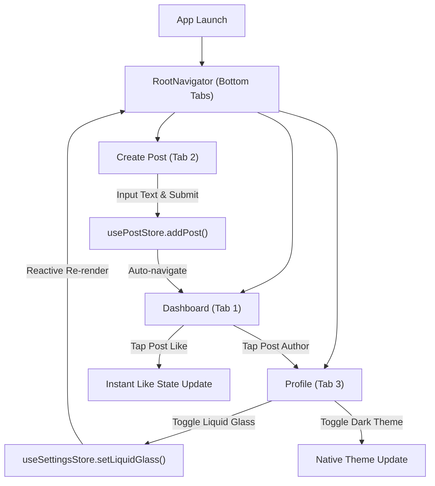

# Route & Screen Architecture: Mobile UI (`mobile-ui`)
> **Routing Engine:** React Navigation v7 (`@react-navigation/bottom-tabs` & `@react-navigation/native`)  
> **Layout Shell:** Floating Glass Tab Bar (`RootNavigator.tsx`)  
> **Status:** Living Document & Foundation Specification

---

## 1. Navigation Architecture & Shell Hierarchy

### 1.1 Overview
The `mobile-ui` client uses a bottom-tab navigation architecture optimized for single-handed mobile operation. The root container `RootNavigator.tsx` wraps all top-level destinations within an absolute-positioned floating glass tab bar (`GlassTabBar`) and a transparent frosted header (`headerBackground` with `LiquidGlassView`).

### 1.2 Screen Hierarchy

```
mobile-ui/src/
├── navigation/
│   └── RootNavigator.tsx               # Root Bottom Tab Navigator + Glass Tab Bar
├── screens/
│   ├── DashboardScreen.tsx             # Route: "Dashboard" (Timeline Feed)
│   ├── CreatePostScreen.tsx            # Route: "CreatePost" (Post Composer Modal/Tab)
│   └── ProfileScreen.tsx               # Route: "Profile" (User Stats & Settings)
├── store/
│   ├── usePostStore.ts                 # Timeline feed state (Posts list, creation, demo data)
│   └── useSettingsStore.ts             # App preferences (Liquid Glass toggle, Dark Mode toggle)
└── constants/
    └── mockData.ts                     # Initial post feed data & user profile mock
```

---

## 2. Screen & Route Registry

| Screen Route Name | Screen File | Type | Header Title | Store Dependencies | Primary User Action |
| :--- | :--- | :--- | :--- | :--- | :--- |
| `Dashboard` | `screens/DashboardScreen.tsx` | Tab Root | "Dashboard" | `usePostStore`, `useSettingsStore` | Scroll timeline, like posts, load demo posts |
| `CreatePost` | `screens/CreatePostScreen.tsx` | Tab Action | "Create Post" | `usePostStore` | Compose new post, attach photo URL, publish |
| `Profile` | `screens/ProfileScreen.tsx` | Tab Root | "Profile" | `useSettingsStore` | View user metrics, toggle Liquid Glass on/off, toggle dark mode |

---

## 3. Detailed Screen Blueprints

### 3.1 Dashboard Screen (`Dashboard`)
- **Route Name:** `Dashboard`
- **File:** `src/screens/DashboardScreen.tsx`
- **Components:** `FlatList`, `GlassCard`, `StreamlineColorIcon`, `Feather` icons, empty state CTA button.
- **Layout & Scrolling:**
  - Content scrolls underneath the transparent frosted header (`headerTransparent: true`) and above the bottom tab bar.
  - Content padding takes into account top notch insets (`insets.top + 60`) and bottom tab height (`56 + insets.bottom + 16`).
- **Interaction Behaviors:**
  - **Like Toggle:** Tap heart icon to increment/decrement like count with instant state update.
  - **Pull to Refresh:** Refreshes feed from remote API (or reloads mock post set).
  - **Empty State:** If posts array is empty, renders frosted empty container with a "Load Demo Posts" button.

### 3.2 Create Post Screen (`CreatePost`)
- **Route Name:** `CreatePost`
- **File:** `src/screens/CreatePostScreen.tsx`
- **Components:** `TextInput` (multiline composer), image preview card, `GlassButton` (Publish CTA).
- **Features:**
  - Auto-expanding text input with glass backdrop.
  - Photo attachment placeholder (supports image URI mock).
  - On submit: Appends post to `usePostStore`, clears form, and navigates back to `Dashboard`.

### 3.3 Profile & Settings Screen (`Profile`)
- **Route Name:** `Profile`
- **File:** `src/screens/ProfileScreen.tsx`
- **Components:** Profile header card, stats counter pills (Posts, Followers, Following), `Switch` toggles inside frosted list items.
- **Key Toggles & Features:**
  - **Liquid Glass Toggle:** Calls `setLiquidGlass(!liquidGlass)`. When disabled, dynamically switches all surfaces to solid platform fallbacks (`#F2F2F7` / `#121212`) without app restart.
  - **Dark Mode Switch:** Dynamically switches color tokens between light and dark palettes.
  - **Account Details:** Shows user avatar, display name, handle, and bio.

---

## 4. User Navigation Flow



---

## 5. Screen Addition & Deep Link Expansion Playbook

When adding a new screen to `mobile-ui`:
1. **Define Param List:** Update `RootTabParamList` (or create a `RootStackParamList` if introducing modal stack screens) in `src/types/index.ts`.
2. **Implement Screen:** Create `src/screens/<NewScreen>.tsx`, ensuring use of `LiquidGlassView` or `GlassCard` for visual consistency.
3. **Register Route in Navigator:** Add `<Tab.Screen>` or `<Stack.Screen>` in `RootNavigator.tsx`.
4. **Update ROUTE.md:** Document the screen in Section 2 Registry and Section 3 Blueprint.
