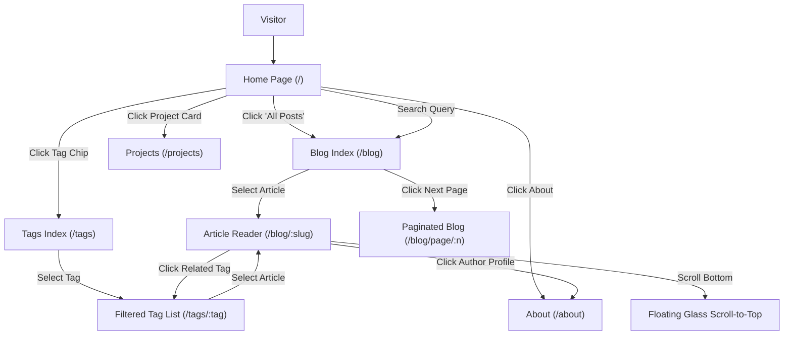

# Route & Screen Architecture: Tekgo UI (`tekgo-ui`)
> **Routing Engine:** Next.js 15 App Router (`app/`)  
> **Layout Shell:** Root Layout with Frosted Navigation (`app/layout.tsx`)  
> **Status:** Living Document & Foundation Specification

---

## 1. Routing Engine & Directory Architecture

### 1.1 Overview
`tekgo-ui` is built on the **Next.js 15 App Router** using file-system routing under the `app/` directory. All public views share a consistent root layout (`app/layout.tsx`) featuring a sticky frosted glass navigation bar, responsive content container, and footer.

### 1.2 Route Tree Hierarchy

```
tekgo-ui/app/
├── layout.tsx                                  # Global Root Layout (Header, Providers, Footer)
├── page.tsx                                    # Route: "/" (Home / Featured Feed)
├── Main.tsx                                    # Home layout component with newsletter & recent posts
├── not-found.tsx                               # 404 Glass Error View
├── robots.ts / sitemap.ts                      # SEO crawlers & indexing
├── about/
│   └── page.tsx                                # Route: "/about" (Author profile & bio)
├── blog/
│   ├── page.tsx                                # Route: "/blog" (Blog index page 1)
│   ├── page/[page]/page.tsx                    # Route: "/blog/page/:page" (Paginated archives)
│   └── [...slug]/page.tsx                      # Route: "/blog/*" (Article reader & nested posts)
├── tags/
│   ├── page.tsx                                # Route: "/tags" (Taxonomy catalog)
│   ├── [tag]/page.tsx                          # Route: "/tags/:tag" (Tag-filtered articles)
│   └── [tag]/page/[page]/page.tsx              # Route: "/tags/:tag/page/:page" (Paginated tag articles)
├── projects/
│   └── page.tsx                                # Route: "/projects" (Showcase card grid)
└── api/
    └── newsletter/route.ts                     # API Route: "/api/newsletter" (Subscription handler)
```

---

## 2. Screen & Route Registry Matrix

| Route Path | File Location | Render Type | Layout Shell | Primary User Action / Feature |
| :--- | :--- | :--- | :--- | :--- |
| `/` | `app/page.tsx` | Static / ISR | Root Layout | View hero greeting, read latest articles, subscribe to newsletter |
| `/blog` | `app/blog/page.tsx` | Static / ISR | Root Layout | Search articles by keyword, view post cards, navigate pagination |
| `/blog/page/[page]` | `app/blog/page/[page]/page.tsx`| Dynamic / SSG | Root Layout | Browse historical article archives by page number |
| `/blog/[...slug]` | `app/blog/[...slug]/page.tsx` | Dynamic / SSG | PostLayout / Simple | Read long-form article, view code samples, post comments |
| `/tags` | `app/tags/page.tsx` | Static | Root Layout | Browse topic tags with post frequency counters |
| `/tags/[tag]` | `app/tags/[tag]/page.tsx` | Dynamic / SSG | Root Layout | View all posts associated with a specific topic tag |
| `/tags/[tag]/page/[page]` | `app/tags/[tag]/page/[page]/page.tsx` | Dynamic / SSG | Root Layout | Paginated view of tag-specific post archives |
| `/projects` | `app/projects/page.tsx` | Static | Root Layout | Browse portfolio cards with live demo and GitHub repository links |
| `/about` | `app/about/page.tsx` | Static | AuthorLayout | View author biography, credentials, and social links |
| `/api/newsletter` | `app/api/newsletter/route.ts` | Server Route | None | Handle email newsletter subscription submissions |

---

## 3. Detailed Screen Blueprints

### 3.1 Home Screen (`/`)
- **Route:** `app/page.tsx` (renders `Main.tsx`)
- **Layout:** Centered single-column layout within `SectionContainer`.
- **Sections:**
  - Hero introduction with subtle typography and animated welcome text.
  - Latest Posts list (top 5 posts) with dates, tags, and summary snippets.
  - "All Posts →" link leading to `/blog`.
  - Frosted Newsletter Subscription Card with email input and submit button.

### 3.2 Blog Catalog & Pagination (`/blog`, `/blog/page/[page]`)
- **Routes:** `app/blog/page.tsx` & `app/blog/page/[page]/page.tsx`
- **Features:**
  - Top search input bar for client-side title/summary filtering.
  - Paginated article stream (default 5 posts per page).
  - Numbered pagination controls ("Previous" / "Next" buttons with frosted states).

### 3.3 Article Reader (`/blog/[...slug]`)
- **Route:** `app/blog/[...slug]/page.tsx`
- **Layout Variants:**
  - `PostLayout`: Standard editorial layout with author sidebar and Table of Contents.
  - `PostSimple`: Minimalist reading layout without sidebars.
  - `PostBanner`: Wide hero header banner image format.
- **Components:** `PortableTextRenderer`, syntax-highlighted code blocks, `Comments` widget, `ScrollTopAndComment` floating glass action button.

### 3.4 Taxonomy & Tags (`/tags`, `/tags/[tag]`)
- **Routes:** `app/tags/page.tsx` & `app/tags/[tag]/page.tsx`
- **Features:**
  - Tag cloud index displaying tags alongside count pills (e.g., `next-js (3)`, `tailwind (2)`).
  - Clicking any tag navigates to `/tags/[tag]` filtered feed.

### 3.5 Projects Showcase (`/projects`)
- **Route:** `app/projects/page.tsx`
- **Components:** `Card.tsx` grid (`grid grid-cols-1 md:grid-cols-2 gap-6`).
- **Features:** Cards render thumbnail banners, title, descriptive summary, and external link buttons.

### 3.6 About Author (`/about`)
- **Route:** `app/about/page.tsx`
- **Data Source:** `data/authors/default.json` and `data/authors/sparrowhawk.json`.
- **Components:** `AuthorLayout`, avatar image with specular glass ring, bio text, social icons (`@project0/ui`).

---

## 4. User Navigation Flow



---

## 5. Adding New Pages (Developer & Agent Playbook)

When introducing a new section or route to `tekgo-ui`:
1. **Create Page Directory:** Add `app/<feature-name>/page.tsx`.
2. **Configure Navigation:** If the page should appear in the header, update `data/headerNavLinks.ts`.
3. **Ensure SEO Metadata:** Export `genPageMetadata()` from `app/seo.tsx` for optimal search indexing.
4. **Enforce Liquid Glass:** Utilize existing frosted styles (`bg-white/65 dark:bg-slate-900/65 backdrop-blur-xl border border-white/30 dark:border-white/10`) for cards and interactive panels.
5. **Update ROUTE.md:** Document the route in Section 2 Matrix and Section 3 Blueprint.
