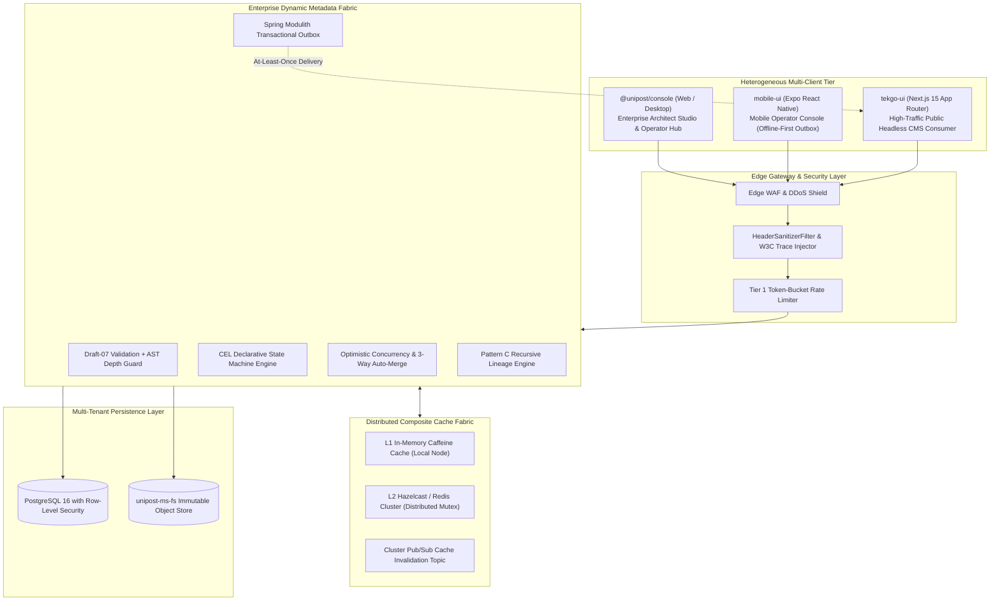
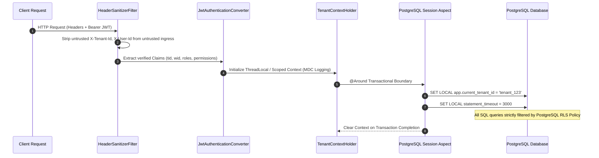
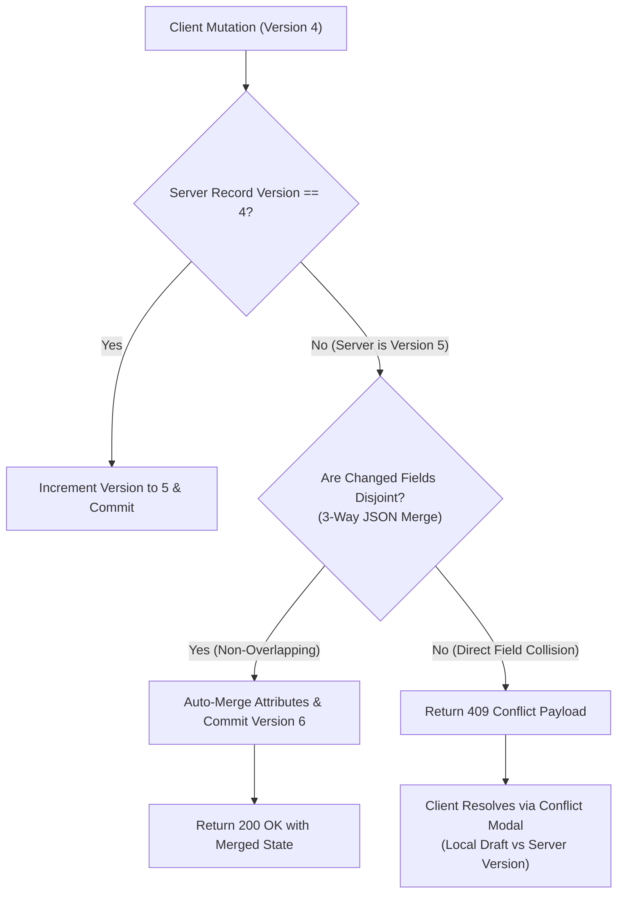
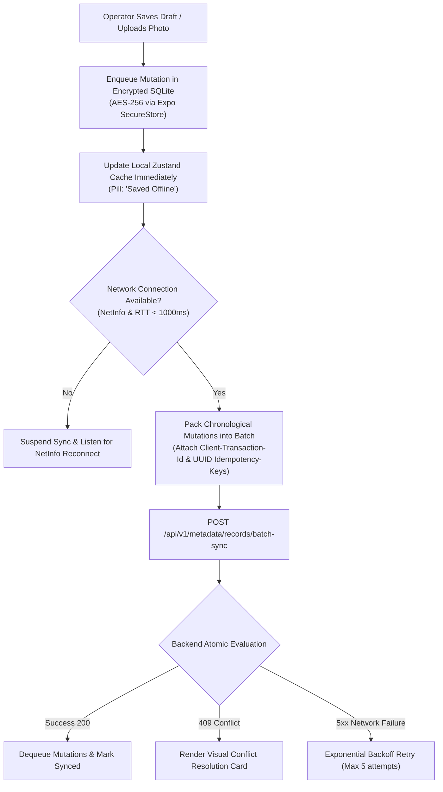
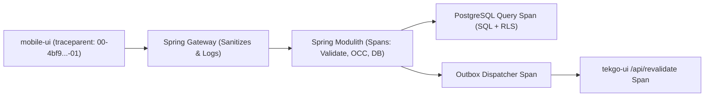
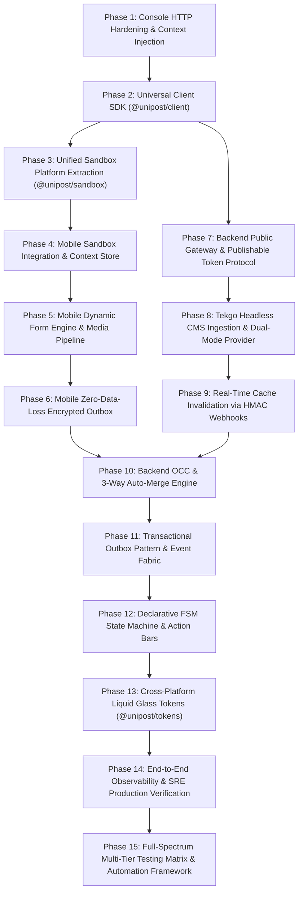
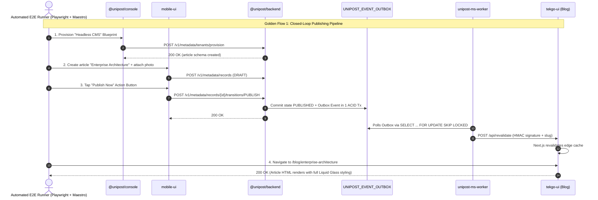
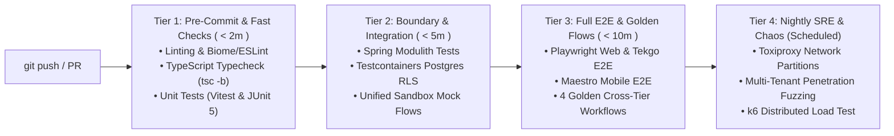

# Architecture & Alignment Blueprint: Enterprise-Grade Multi-Tier Monorepo Strategy

> **Classification:** Living Architectural Specification & Enterprise Systems Standard  
> **Authors:** Lead Systems Architect & Full-Stack Engineering Team  
> **Target Scope:** `@unipost/backend`, `@unipost/console`, `@unipost/desktop`, `mobile-ui`, `tekgo-ui`, and `packages/*`  
> **Core Pillars:** Zero-Downtime Dynamic Metadata, Zero-Trust Multi-Tenancy, Transactional Outbox, Cache Stampede Defense, Optimistic Concurrency Control, and W3C Distributed Tracing.

---

## 1. Executive Vision: The Converged Enterprise Platform

The Unipost platform unites high-throughput Java 21 / Spring Modulith backend micro-modules with a heterogeneous multi-client presentation tier (React 19 / Vite 8, Electrobun, Expo SDK 57 / React Native, and Next.js 15). 

To achieve **enterprise-grade reliability, multi-tenant fault isolation, and zero data loss**, the platform elevates **Dynamic Metadata** from an administrative tool into a mission-critical **Application Fabric**:



---

## 2. Zero-Trust Multi-Tenancy & Blast Radius Isolation

Enterprise platforms must guarantee that a malfunction, noisy neighbor, or security breach in Tenant A can never compromise Tenant B.

### 2.1 Three-Tier Multi-Tenant Context Pipeline
Every incoming HTTP request traverses a strict sanitization and context resolution ladder before reaching domain controllers:



### 2.2 Per-Tenant Dynamic Circuit Breakers & Resource Quotas
To prevent single-tenant cascading failures:
1. **Database Semaphore Quota**: PostgreSQL connections per tenant are capped via a distributed token bucket. A tenant saturating its concurrent connection pool receives an immediate HTTP `429 Too Many Requests` with a `Retry-After: 2` header, protecting sibling tenants.
2. **Schema Complexity & AST Depth Limiter**:
   - Maximum attribute definitions per entity: **128**.
   - Maximum JSON Schema nesting depth: **6 levels**.
   - Regex Validation Timeout: Worker execution capped at **50ms** via `InterruptibleCharSequence` to completely neutralize Regular Expression Denial of Service (ReDoS) attacks.
3. **Statement Execution Timeout**: All tenant transactions execute under `SET LOCAL statement_timeout = '3000ms'`. Runaway analytical queries are aborted before degrading write capacity.

---

## 3. Concurrency Control & Zero-Data-Loss Architecture

When mobile operators on cellular networks and desktop operators on broadband collaborate concurrently, collision is inevitable. The platform rejects naive "last-write-wins" semantics in favor of mathematical consistency.

### 3.1 Optimistic Concurrency Control (OCC) with 3-Way Auto-Merge

Every entity record in `UNIPOST_ENTITY_RECORDS` maintains a strict integer column `version` and `updated_date`:

```sql
UPDATE UNIPOST_ENTITY_RECORDS
SET attributes = :mergedAttributes,
    version = version + 1,
    updated_date = CURRENT_TIMESTAMP
WHERE id = :recordId
  AND tenant_id = :tenantId
  AND version = :expectedVersion;
```

#### Collision Resolution Engine
When `mobile-ui` or `@unipost/console` submits a mutation with an outdated version:



1. **Non-Overlapping Mutations**: If Operator A edited `attributes.title` while Operator B edited `attributes.tags`, the backend executes an automatic three-way merge, commits `version + 1`, and returns the merged document with the header `X-Merge-Status: auto-resolved`.
2. **True Attribute Collisions**: If both edited `attributes.body`, the backend returns `HTTP 409 Conflict` containing the full RFC 6902 conflict delta and server base state.

---

### 3.2 Transactional Outbox Pattern for Asynchronous Delivery

External notifications, webhook dispatches to `tekgo-ui`, and search indexing must **never execute directly within the database transaction**. If the network drops mid-HTTP call, the database either rolls back unnecessarily or the webhook is permanently lost.

#### Architectural Specification:
```sql
CREATE TABLE UNIPOST_EVENT_OUTBOX (
    id UUID PRIMARY KEY DEFAULT gen_random_uuid(),
    tenant_id VARCHAR(64) NOT NULL,
    event_type VARCHAR(128) NOT NULL,
    aggregate_id VARCHAR(64) NOT NULL,
    payload JSONB NOT NULL,
    headers JSONB NOT NULL,
    status VARCHAR(32) NOT NULL DEFAULT 'PENDING',
    retry_count INT NOT NULL DEFAULT 0,
    created_date TIMESTAMP WITH TIME ZONE DEFAULT CURRENT_TIMESTAMP,
    processed_date TIMESTAMP WITH TIME ZONE
);

CREATE INDEX idx_outbox_pending ON UNIPOST_EVENT_OUTBOX(status, created_date) WHERE status = 'PENDING';
```

1. **Atomic Write**: In `EntityRecordService.saveRecord()`, the record row and the `UNIPOST_EVENT_OUTBOX` entry are committed in the **identical ACID transaction**.
2. **Guaranteed Delivery Worker**: `unipost-ms-worker` polls `UNIPOST_EVENT_OUTBOX` using `SELECT ... FOR UPDATE SKIP LOCKED` and dispatches webhooks with exponential backoff ($2^n \times 500\text{ms}$, max 5 retries).
3. **Dead Letter Queue (DLQ)**: Failed dispatches transition to `DEAD_LETTER` with error stack traces, surfacing in the `@unipost/console` System Health panel for operator replay.

---

## 4. Cache Fabric Reliability & Cache Stampede Defense

In high-traffic environments, sudden traffic bursts (e.g. a viral post on `tekgo-ui`) can trigger cache stampedes (dogpiling) where thousands of requests bypass an expired cache and take down the database.

### 4.1 Probabilistic Early Expiration (XFetch Algorithm)
To guarantee that hot cache keys are regenerated **before** they expire:

$$\Delta t \propto -\beta \cdot \delta \cdot \ln(r)$$

Where:
- $\delta$ is the delta compute time required to query PostgreSQL.
- $\beta > 0$ is an aggressiveness constant ($\beta = 1.0$).
- $r \sim \text{Uniform}(0, 1)$ is a pseudo-random value.

When a reader accesses a cache key within its revalidation threshold, a single request triggers a background cache refresh while all current readers receive instantaneous cached responses.

### 4.2 Distributed Mutex (`FencedLock`) for L2 Cache Regeneration
If a cold cache miss occurs, the backend acquires a distributed Hazelcast `FencedLock`:

```java
// apps/backend/unipost-fw/src/main/java/com/unipost/cache/ResilientCacheManager.java
public CompiledSchema getCompiledSchema(String tenantId, String entityTypeId) {
    String cacheKey = CompositeCacheKey.of(tenantId, entityTypeId);
    CompiledSchema cached = l1Cache.get(cacheKey);
    if (cached != null) return cached;

    cached = l2HazelcastMap.get(cacheKey);
    if (cached != null) {
        l1Cache.put(cacheKey, cached);
        return cached;
    }

    // Acquire Distributed Mutex to prevent DB dogpiling
    FencedLock lock = hazelcastInstance.getCPSubsystem().getLock("lock:" + cacheKey);
    if (lock.tryLock(500, TimeUnit.MILLISECONDS)) {
        try {
            // Double-check after lock acquisition
            cached = l2HazelcastMap.get(cacheKey);
            if (cached != null) return cached;

            CompiledSchema fresh = compileFromDatabase(tenantId, entityTypeId);
            l2HazelcastMap.put(cacheKey, fresh, 60, TimeUnit.MINUTES);
            l1Cache.put(cacheKey, fresh);
            return fresh;
        } finally {
            lock.unlock();
        }
    } else {
        // Fallback: return stale cache or wait briefly
        return l2HazelcastMap.getOrDefault(cacheKey, FallbackSchema.EMPTY);
    }
}
```

---

## 5. Mobile Operator Console: Zero-Data-Loss Engine (`mobile-ui`)

Mobile operators operate in transit over unreliable cellular networks. The `mobile-ui` client guarantees zero data loss through an offline-first, encrypted outbox architecture.



### Mobile Offline Outbox Technical Specifications:
1. **Cryptographic Storage**: Drafts and pending mutations are persisted in SQLite encrypted via SQLCipher with keys derived from `Expo.SecureStore`.
2. **Two-Phase Mutation Receipts**:
   - Every mutation carries a unique `mutationId` and `clientTimestamp`.
   - The backend responds with an array of individual receipts:
     ```json
     {
       "clientTransactionId": "tx_902183",
       "receipts": [
         { "mutationId": "mut_001", "status": "COMMITTED", "serverVersion": 5 },
         { "mutationId": "mut_002", "status": "MERGED", "serverVersion": 6 }
       ]
     }
     ```
3. **Battery & Data-Saver Intelligence**: Background synchronizations pause when device battery drops below **15%** or if the OS reports metered network mode, unless explicitly overridden by user pull-to-refresh.

---

## 6. Public Ingestion Gateway & Security for `tekgo-ui` (Blog Website)

`tekgo-ui` is a public-facing storefront. It must be resilient against scrapers, DDoS attacks, and API key leaks.

### 6.1 Cryptographic Publishable Token Architecture
To read published articles without passing sensitive credentials:
1. **Publishable Token**: `pk_live_{tenantSlug}_{sha256Hex}` is embedded into Next.js environment configurations.
2. **Read-Only Scope Enforcement**: The backend gateway strictly permits `SELECT` operations on records flagged with `status = 'PUBLISHED'`. Any attempt to invoke mutations, read drafts, or access private models yields `HTTP 403 Forbidden`.
3. **Rate Limiting**: Public endpoints enforce a strict token-bucket rate limit (**100 req/sec per IP**, **2000 req/sec aggregate per tenant**).

### 6.2 Signed Webhook Protocol with Timestamp Replay Protection
When an article is published from Console or Mobile, `unipost-ms-worker` delivers an HMAC-SHA256 signed payload to `tekgo-ui`:

$$\text{Signature} = \text{HMAC-SHA256}(\text{Secret}, \text{Timestamp} + "." + \text{Payload})$$

```typescript
// apps/tekgo-ui/app/api/revalidate/route.ts
export async function POST(req: NextRequest) {
  const signature = req.headers.get('x-unipost-signature');
  const timestamp = req.headers.get('x-unipost-timestamp');
  const secret = process.env.UNIPOST_WEBHOOK_SECRET!;

  // 1. Prevent Replay Attacks (Reject requests older than 300 seconds)
  const currentTime = Math.floor(Date.now() / 1000);
  if (!timestamp || Math.abs(currentTime - parseInt(timestamp, 10)) > 300) {
    return NextResponse.json({ error: 'Replay window expired' }, { status: 401 });
  }

  // 2. Cryptographic Signature Validation
  const rawBody = await req.text();
  const expectedSig = crypto
    .createHmac('sha256', secret)
    .update(`${timestamp}.${rawBody}`)
    .digest('hex');

  if (signature !== expectedSig) {
    return NextResponse.json({ error: 'Invalid HMAC signature' }, { status: 401 });
  }

  const { slug, tag } = JSON.parse(rawBody);
  if (slug) revalidatePath(`/blog/${slug}`);
  if (tag) revalidateTag(tag);
  revalidatePath('/blog');

  return NextResponse.json({ revalidated: true, timestamp: Date.now() });
}
```

---

## 7. Distributed Observability & W3C Trace Propagation

When a request spans multiple clients, proxies, workers, and databases, root-cause analysis requires end-to-end distributed tracing.



1. **W3C Trace Context Standard**:
   - Format: `traceparent: {version}-{traceId}-{parentId}-{traceFlags}`.
   - All client SDKs (`@unipost/client`) automatically generate and forward W3C trace headers.
2. **Mapped Diagnostic Context (MDC)**:
   - Every log line in `@unipost/backend` automatically includes:
     `[trace_id=%X{traceId}] [tenant_id=%X{tenantId}] [user_id=%X{userId}] [workspace_id=%X{workspaceId}]`.
3. **OpenTelemetry Exporters**: Metrics (p95 latency, error rates, GC pauses, cache hits) and traces stream to Grafana / Jaeger / Datadog.

---

## 8. Multi-Platform Liquid Glass Token Engine & WCAG 2.2 AA Parity

The mandatory monorepo visual standard—**Liquid Glass**—must be mathematically specified across all platforms to eliminate visual drift:

```typescript
// Proposed: packages/tokens/src/glass.ts
export const LiquidGlassTokens = {
  blur: {
    xs: 4,
    sm: 8,
    md: 16,
    lg: 24,
    xl: 32,
    xxl: 48,
  },
  scrim: {
    ultraLight: { light: 'rgba(255, 255, 255, 0.40)', dark: 'rgba(15, 23, 42, 0.40)' },
    standard:   { light: 'rgba(255, 255, 255, 0.65)', dark: 'rgba(15, 23, 42, 0.65)' }, // WCAG 2.2 AA compliant
    highContrast:{ light: 'rgba(255, 255, 255, 0.85)', dark: 'rgba(15, 23, 42, 0.85)' },
  },
  borders: {
    specularLight: 'rgba(255, 255, 255, 0.35)',
    specularDark:  'rgba(255, 255, 255, 0.12)',
    insetHighlight:'rgba(255, 255, 255, 0.40)',
  },
  elevation: {
    flat:    'none',
    card:    '0 8px 32px 0 rgba(0, 0, 0, 0.08)',
    modal:   '0 16px 48px 0 rgba(0, 0, 0, 0.16)',
    floating:'0 24px 64px 0 rgba(0, 0, 0, 0.24)',
  },
} as const;
```

---

## 9. Monorepo Shared Package Topology (`packages/*`)

```
packages/
├── client/ (@unipost/client)
│   ├── DTO Interfaces (Metadata, Records, Blueprints, Billing, Auth, FSM)
│   ├── Universal Fetch Client with W3C Trace Injection & 401 Refresh
│   ├── 3-Way Auto-Merge Client Engine & OCC Conflict Wrappers
│   └── Typed Error Payloads (RFC 7807 ProblemDetail)
├── sandbox/ (@unipost/sandbox)
│   ├── Unified Sandbox Engine & Registry
│   ├── Built-in Handlers: Auth, Metadata, Users, Tasks, Billing
│   ├── Mobile Sandbox Adapter (Zero hardcoded mocks)
│   └── Stateful Reset & Persona Switching Utilities
├── tokens/ (@unipost/tokens)
│   ├── OKLCH Color Scales & Semantic Scrims
│   ├── Liquid Glass Metrics (Blur, Borders, Insets, Elevation)
│   └── Cross-Platform Exports for Tailwind v4 and React Native StyleSheet
├── ui/ (@unipost/ui)
│   ├── Web Liquid Glass Components (Buttons, Modals, Cards, Popovers)
│   └── Headless Renderers: <DynamicEntityForm /> & <DynamicDataGrid />
└── i18n/ (@unipost/i18n)
    └── Centralized Translation Dictionaries (locales/en, locales/vi)
```

---

## 10. Granular Deep-Dive Implementation Roadmap (15 Phases)

To eliminate big-bang delivery risks, cognitive overload, and inter-team blocking, the architecture is partitioned into **15 discrete, testable, and incrementally shippable phases**:



---

### Phase 1: `@unipost/console` HTTP Hardening & Context Injection
- **Objective:** Eliminate rogue global `axios` calls in `@unipost/console` and unify context header propagation.
- **Affected Files:**
  - `apps/console/src/features/metadata/api/use-blueprints.ts`
  - `apps/console/src/features/metadata/api/use-billing.ts`
  - `apps/console/src/features/spring-auth/api-client.ts`
- **Technical Design:**
  - Route all Blueprint and Billing queries through `springApiClient`.
  - Add request interceptor in `spring-auth/api-client.ts` injecting `X-Tenant-Id` and `X-Workspace-Id` from `useMetadataUiStore.getState()`.
  - Standardize response unwrapping: `unwrapResponse(data) => data?.body ?? data?.data ?? data`.
- **Pre-requisites:** None.
- **Verification Gates:**
  - `pnpm --filter @unipost/console test` passes (91/91 tests).
  - Grep verification confirms zero occurrences of `import axios from 'axios'` in `features/metadata/api/`.
- **Rollback Strategy:** Revert commit; standard git checkout.

---

### Phase 2: Universal Client SDK (`packages/client`)
- **Objective:** Extract typed DTOs and universal HTTP client into a shared monorepo package.
- **Affected Packages:**
  - Create `packages/client/package.json`, `packages/client/src/index.ts`
  - Migrate DTOs from `apps/console/src/features/metadata/api/types.ts`
- **Technical Design:**
  - Universal `UnipostClient` relying on standard `fetch` with W3C `traceparent` generator.
  - Export domain interfaces: `EntityType`, `AttributeDefinition`, `EntityRecord`, `BlueprintManifest`, `TenantBillingSummary`, `CheckoutResponse`, `ProblemDetail`.
  - Include 401 silent refresh callback and request interceptor hooks.
- **Pre-requisites:** Phase 1 complete.
- **Verification Gates:**
  - `pnpm --filter @unipost/client test` passes with 100% coverage on request encoding, traceparent generation, and error mapping.
  - `@unipost/console` builds cleanly (`tsc -b`) importing DTOs from `@unipost/client`.

---

### Phase 3: Unified Sandbox Platform Extraction (`packages/sandbox`)
- **Objective:** Extract the Unified Sandbox engine from `@unipost/console` to allow multi-client usage.
- **Affected Packages:**
  - Create `packages/sandbox/`
  - Move core logic from `apps/console/src/core/sandbox/`
- **Technical Design:**
  - Export `SandboxRegistry`, `createSandboxHandler`, `SandboxRouteHandler`.
  - Implement both `AxiosSandboxAdapter` (for Console) and `FetchSandboxAdapter` (for React Native and Next.js).
  - Port built-in domain handlers: Auth, Metadata, Users, Tasks, Billing.
- **Pre-requisites:** Phase 2 complete.
- **Verification Gates:**
  - `@unipost/console` sandbox tests pass using the extracted `@unipost/sandbox` package.
  - Zero behavioral regressions in Console Architect Studio and Operator View.

---

### Phase 4: `mobile-ui` Sandbox Integration & Context Store
- **Objective:** Bring `mobile-ui` into 100% compliance with [`.agents/rules/02-unified-sandbox.md`](file:///c:/Users/Admin/workspace/git/unipost/.agents/rules/02-unified-sandbox.md).
- **Affected Files:**
  - Delete `apps/mobile-ui/src/constants/mockData.ts`
  - Refactor `apps/mobile-ui/src/store/usePostStore.ts`
  - Create `apps/mobile-ui/src/store/useMobileContextStore.ts`
- **Technical Design:**
  - In `apps/mobile-ui/src/navigation/RootNavigator.tsx`, initialize `attachSandboxFetchInterceptor()`.
  - Replace hardcoded post mutations with `unipostClient.request('/v1/metadata/records?entityType=post')`.
  - Wire pull-to-refresh to fetch directly from sandbox-intercepted client.
- **Pre-requisites:** Phase 3 complete.
- **Verification Gates:**
  - `pnpm --filter mobile-ui start` boots; Dashboard displays feed loaded from Sandbox Metadata Handler.
  - Zero references to `mockData.ts` remain in `apps/mobile-ui`.

---

### Phase 5: `mobile-ui` Dynamic Form Engine & Media Pipeline
- **Objective:** Enable mobile operators to create/edit records for any entity model with photo uploads.
- **Affected Files:**
  - Create `apps/mobile-ui/src/components/dynamic-form/DynamicFieldRenderer.tsx`
  - Create `apps/mobile-ui/src/components/dynamic-form/MediaPickerInput.tsx`
  - Create `apps/mobile-ui/src/components/dynamic-form/RelationPickerBottomSheet.tsx`
- **Technical Design:**
  - Maps `CompiledSchema` properties to React Native inputs with Liquid Glass styling.
  - Integrates `expo-image-picker` with client-side JPEG/WebP compression (max 1920px, 85% quality).
  - Streams binary to `unipost-ms-fs` via `/fs/objects/upload`, returns immutable content URI.
- **Pre-requisites:** Phase 4 complete.
- **Verification Gates:**
  - Creating a record dynamically renders input fields conforming to entity's JSONSchema.
  - Selected image uploads to filesystem service and attaches URL to record payload.

---

### Phase 6: `mobile-ui` Zero-Data-Loss Encrypted Outbox (`useOutboxStore`)
- **Objective:** Guarantee zero data loss for mobile operators working on intermittent cellular networks.
- **Affected Files:**
  - Create `apps/mobile-ui/src/store/useOutboxStore.ts`
  - Create `apps/mobile-ui/src/components/conflict/ConflictResolutionModal.tsx`
- **Technical Design:**
  - Persists pending RFC 6902 mutations in SQLCipher / encrypted AsyncStorage with keys from `Expo.SecureStore`.
  - Attaches `Client-Transaction-Id` and per-mutation idempotency UUIDs.
  - Dispatches sync batches on network reconnect via `NetInfo`.
  - Renders visual 2-column diff modal on HTTP 409 collisions.
- **Pre-requisites:** Phase 5 complete.
- **Verification Gates:**
  - Airplane mode simulation: edit record -> restart app -> reconnect network -> mutations commit cleanly.
  - Duplicate dispatch test confirms server processes mutation exactly once.

---

### Phase 7: Backend Public Ingestion Gateway & Publishable Key Protocol
- **Objective:** Allow public readers on `tekgo-ui` to read published content safely without credentials.
- **Affected Files:**
  - `apps/backend/unipost-fw/src/main/java/com/unipost/presentation/PublicCmsGatewayController.java`
  - `apps/backend/unipost-fw/src/main/java/com/unipost/security/PublishableKeyFilter.java`
- **Technical Design:**
  - Generates scoped publishable keys: `pk_live_{tenantSlug}_{hash}`.
  - Exposes `GET /api/v1/public/tenants/{tenantId}/cms/records?entityType=article`.
  - Enforces `WHERE status = 'PUBLISHED' AND deleted_date IS NULL` under tenant RLS.
  - Enforces Tier 1 rate limiting (100 req/s per IP) and sets `Cache-Control: public, s-maxage=60`.
- **Pre-requisites:** Phase 2 complete.
- **Verification Gates:**
  - Spring Modulith test: public request fetches published articles; accessing draft article returns HTTP 404/403.
  - Tampered tenant header test: request rejected with HTTP 401.

---

### Phase 8: `tekgo-ui` Headless CMS Ingestion & Dual-Mode Provider
- **Objective:** Transform `tekgo-ui` into a live consumer of the backend Headless CMS blueprint.
- **Affected Files:**
  - Create `apps/tekgo-ui/lib/cms/unipost-cms-client.ts`
  - Create `apps/tekgo-ui/lib/cms/content-provider.ts`
  - Refactor `apps/tekgo-ui/app/blog/page.tsx` & `apps/tekgo-ui/app/blog/[...slug]/page.tsx`
- **Technical Design:**
  - Dual-mode data toggle: `DATA_SOURCE=cms | local`.
  - In CMS mode, queries public gateway using Next.js 15 `fetch(..., { next: { tags: ['articles'], revalidate: 60 } })`.
  - Maps dynamic attributes (`title`, `slug`, `content_body`, `cover_image_url`, `tags`) to Next.js Post layout.
- **Pre-requisites:** Phase 7 complete.
- **Verification Gates:**
  - Next.js production build (`pnpm --filter tekgo-ui build`) succeeds with SSG/ISR page generation.
  - Setting `DATA_SOURCE=local` seamlessly falls back to local markdown archives.

---

### Phase 9: Real-Time Edge Invalidation via HMAC Signed Webhooks
- **Objective:** Instantaneously update `tekgo-ui` reader views when an article is published.
- **Affected Files:**
  - `apps/backend/unipost-ms-worker/src/main/java/com/unipost/worker/service/WebhookDeliveryService.java`
  - Create `apps/tekgo-ui/app/api/revalidate/route.ts`
- **Technical Design:**
  - `unipost-ms-worker` delivers outbound webhook with `x-unipost-signature: HMAC-SHA256(secret, timestamp + "." + body)`.
  - `tekgo-ui` validates signature, rejects requests older than 300s, and invokes `revalidatePath('/blog/[...slug]')` and `revalidateTag('articles')`.
- **Pre-requisites:** Phase 8 complete.
- **Verification Gates:**
  - Publishing an article in Console/Mobile triggers webhook; Next.js invalidates cache within 500ms.
  - Replay attack test (timestamp > 300s) rejected with HTTP 401.

---

### Phase 10: Backend OCC & 3-Way Auto-Merge Engine
- **Objective:** Eliminate silent data overwrites (last-write-wins) during concurrent edits.
- **Affected Files:**
  - `apps/backend/unipost-fw/src/main/java/com/unipost/service/EntityRecordService.java`
  - `apps/backend/unipost-db/src/main/resources/db/migration/V..._add_occ_version.sql`
- **Technical Design:**
  - Adds integer `version` and `updated_date` columns to `UNIPOST_ENTITY_RECORDS`.
  - In `updateEntityRecord()`, checks `WHERE id = :id AND version = :expectedVersion`.
  - If outdated, computes three-way JSON diff. If non-overlapping, auto-commits `version + 1` with header `X-Merge-Status: auto-resolved`.
  - If true collision occurs, throws `OptimisticLockingException` returning HTTP 409 with RFC 6902 delta.
- **Pre-requisites:** Phase 6 complete.
- **Verification Gates:**
  - Concurrency integration test: 20 threads updating disjoint fields of same record all succeed without data loss.
  - Conflicting edit test returns HTTP 409 with expected conflict payload.

---

### Phase 11: Transactional Outbox Pattern & Event Fabric
- **Objective:** Guarantee at-least-once event delivery without distributed transactions.
- **Affected Files:**
  - Create `UNIPOST_EVENT_OUTBOX` table via Flyway migration.
  - `apps/backend/unipost-fw/src/main/java/com/unipost/outbox/OutboxEventPublisher.java`
  - `apps/backend/unipost-ms-worker/src/main/java/com/unipost/worker/outbox/OutboxPollingJob.java`
- **Technical Design:**
  - Record mutations and outbox entries committed in the same PostgreSQL transaction.
  - `unipost-ms-worker` polls `UNIPOST_EVENT_OUTBOX` using `SELECT ... FOR UPDATE SKIP LOCKED`.
  - Implements exponential backoff retry ($2^n \times 500\text{ms}$) and Dead Letter Queue (DLQ).
- **Pre-requisites:** Phase 9 and Phase 10 complete.
- **Verification Gates:**
  - Integration test simulating network outage during webhook dispatch: worker retries until recovery with zero dropped events.

---

### Phase 12: Declarative FSM State Machine & Action Bars
- **Objective:** Enforce business lifecycle rules across Web and Mobile.
- **Affected Files:**
  - `apps/backend/unipost-fw/src/main/java/com/unipost/fsm/EntityLifecycleEngine.java`
  - Create `apps/mobile-ui/src/components/lifecycle/RecordLifecycleActionBar.tsx`
  - `apps/console/src/features/metadata/components/designer/LifecycleWorkflowEditor.tsx`
- **Technical Design:**
  - Stores `lifecycle_config` in `UNIPOST_ENTITY_TYPES` with states, transitions, required fields, and CEL guards.
  - Exposes `POST /v1/metadata/records/{id}/transitions/{action}`.
  - Mobile renders one-tap transition buttons; Console renders visual workflow editor.
- **Pre-requisites:** Phase 11 complete.
- **Verification Gates:**
  - Transition without required fields or unauthorized role rejected with HTTP 422.
  - Successful transition fires `RecordStateChangedEvent` into Transactional Outbox.

---

### Phase 13: Cross-Platform Liquid Glass Tokens (`@unipost/tokens`)
- **Objective:** Eliminate visual drift between Web and Mobile while enforcing WCAG 2.2 AA.
- **Affected Packages:**
  - Create `packages/tokens/`
  - Wire into `apps/console`, `apps/tekgo-ui`, `apps/mobile-ui`
  - Wire `@unipost/i18n` into `mobile-ui` (`react-i18next`)
- **Technical Design:**
  - Centralizes OKLCH color palettes, specular borders, and blur intensities (8, 16, 24, 32px).
  - Exports Tailwind v4 `@theme` tokens and React Native StyleSheet constants.
  - Enforces minimum 65% scrim opacity behind body text.
- **Pre-requisites:** Phase 5 complete.
- **Verification Gates:**
  - Automated contrast audit verifies all frosted cards achieve contrast $\ge 4.5:1$.
  - Language switching in mobile settings updates UI immediately via `@unipost/i18n`.

---

### Phase 14: End-to-End Observability & SRE Production Verification
- **Objective:** Full-stack distributed tracing, synthetic load validation, and chaos resilience testing.
- **Affected Scope:** Monorepo-wide.
- **Technical Design:**
  - Enforces W3C `traceparent` propagation across Mobile $\to$ Console $\to$ Gateway $\to$ Modulith $\to$ Outbox $\to$ Tekgo.
  - Standardizes MDC logging: `[trace_id] [tenant_id] [user_id] [workspace_id]`.
  - Runs full automated regression test suites across Java 21, Vite 8, React Native, and Next.js 15.
- **Pre-requisites:** Phases 1 through 13 complete.
- **Verification Gates:**
  - Single synthetic transaction traced end-to-end in OpenTelemetry Jaeger/Grafana.
  - Build, lint, and test pipelines pass with zero warnings across all monorepo targets.

---

### Phase 15: Full-Spectrum Multi-Tier Testing Matrix & Automation Framework
- **Objective:** Establish an exhaustive, multi-tiered enterprise testing framework guaranteeing zero regressions, multi-tenant isolation, contract compatibility, and automated cross-client E2E verification across `@unipost/backend`, `@unipost/console`, `mobile-ui`, and `tekgo-ui`.
- **Target Scope:** Monorepo-wide (`apps/*`, `packages/*`, and CI/CD pipelines).

#### 1. Multi-Tier Testing Pyramid Architecture

```mermaid
flowchart TD
    subgraph L5["L5: Non-Functional & SRE Chaos (5%)"]
        SecurityFuzz["Multi-Tenant RLS Leak Fuzzing"]
        Chaos["Toxiproxy Network / DB Partitions"]
        Perf["k6 / Gatling Load & Stress Tests"]
        A11y["@axe-core/playwright WCAG 2.2 AA"]
    end

    subgraph L4["L4: Cross-Tier End-to-End Automation (15%)"]
        PlaywrightWeb["Playwright E2E: Console & Tekgo"]
        MaestroNative["Maestro Native E2E: mobile-ui"]
        GoldenFlows["Cross-Client Closed-Loop Workflows"]
    end

    subgraph L3["L3: Contract & Schema Drift Tests (15%)"]
        Pact["Pact / OpenAPI Spec Compatibility"]
        SchemaDrift["JSON Schema Draft-07 Drift Tests"]
        TypeSync["tsc --noEmit Monorepo Integrity"]
    end

    subgraph L2["L2: Slicing & Boundary Integration (25%)"]
        ModulithTest["Spring Modulith @ApplicationModuleTest"]
        Testcontainers["Testcontainers PostgreSQL with RLS"]
        SandboxFlows["@unipost/sandbox Full Flow Tests"]
        OutboxSyncTest["Offline Outbox Reconnect Sync Tests"]
    end

    subgraph L1["L1: Fast Unit & Component Isolation (40%)"]
        BackendUnit["JUnit 5 + Mockito + AssertJ"]
        WebUnit["Vitest + React Testing Library"]
        MobileUnit["Jest + React Native Testing Library"]
        TokenMath["Liquid Glass Contrast & Blur Math Tests"]
    end

    L1 --> L2
    L2 --> L3
    L3 --> L4
    L4 --> L5
```



---

#### 2. Backend Testing Architecture (`@unipost/backend`)

The Spring Modulith backend enforces four distinct testing slices:

1. **Pure Unit Tests (JUnit 5 + Mockito + AssertJ)**:
   - Target: `unipost-core`, `unipost-fw`.
   - Execution Time: `< 20ms` per test, zero I/O, zero Spring Context.
   - Test Cases:
     - 3-Way Auto-Merge JSON algorithm: verifies non-overlapping field merge vs overlapping conflict detection.
     - XFetch probabilistic early expiration math: verifies recalculation window across random seeds.
     - Google CEL transition guard evaluator: asserts syntax validation, role checking, and rule evaluations.
     - Token bucket rate limiter: asserts burst replenishment and token consumption math.
2. **Spring Modulith Architectural & Scenario Tests (`@ApplicationModuleTest`)**:
   - Target: `unipost-fw`, `unipost-ms-identity`, `unipost-ms-worker`.
   - Verifies module encapsulation: fails compilation if internal packages of `unipost-ms-identity` are accessed directly by `unipost-fw` without public interfaces.
   - Scenario Tests: `Scenario.create(...)` verifies asynchronous domain event emissions (`RecordStateChangedEvent`, `TenantProvisionedEvent`).
3. **Database Integration & RLS Slicing (Testcontainers PostgreSQL 16)**:
   - Target: `unipost-db`, `unipost-fw`.
   - Runs against an ephemeral, real PostgreSQL container with Row-Level Security policies active.
   - Test Cases:
     - Multi-Tenant Isolation: Executes `SET LOCAL app.current_tenant_id = 'tenant_A'`. Asserts that `SELECT * FROM UNIPOST_ENTITY_RECORDS` returns **zero rows** belonging to `tenant_B`.
     - Optimistic Concurrency Control (OCC): Launches 20 concurrent threads attempting to update the same record. Asserts that disjoint updates successfully auto-merge while conflicting updates throw `OptimisticLockingException` returning HTTP 409.
     - Partial Unique Indexes: Asserts that duplicate system names are rejected when `deleted_date IS NULL`, but allowed when previously soft-deleted.
4. **Cache Coherence & Distributed Mutex Tests**:
   - Target: Hazelcast / Redis cluster slice.
   - Cache Stampede Simulation: 50 concurrent virtual threads requesting an uncached entity schema simultaneously. Asserts Hazelcast `FencedLock` ensures exactly **1 database compilation query** occurs; all 49 other threads receive the warmed result from cache.

---

#### 3. Frontend Testing Architecture across Clients

```
apps/
├── console/ (Web & Desktop)
│   ├── Unit / Hook: Vitest + @testing-library/react (useTenantBilling, useBlueprints, etc.)
│   ├── Component: Radix & Liquid Glass UI states, accessibility roles, aria landmarks
│   ├── Integration: Unified Sandbox mock engine flow tests
│   └── E2E: Playwright (Chromium, Firefox, WebKit, Electrobun Desktop)
├── mobile-ui/ (Mobile Operator Companion)
│   ├── Unit: Jest + @testing-library/react-native (useOutboxStore, DynamicFieldRenderer)
│   ├── Integration: FetchSandboxAdapter simulation (offline outbox -> sync reconnect)
│   └── Native E2E: Maestro UI automation (navigation, image picker, pull-to-refresh)
└── tekgo-ui/ (Specialized Public Blog Website)
    ├── Unit: Vitest (Next.js App Router helpers, metadata tags, reading time)
    ├── Integration: Route Handler tests (/api/revalidate signature & replay window)
    └── E2E: Playwright (SSR/ISR page rendering, SEO OpenGraph, newsletter modal)
```

1. **`@unipost/console` (React 19 / Vite 8)**:
   - **Unit & Hook Tests**: Test custom hooks (`useTenantBilling`, `useBlueprints`) with mock query clients; verify RFC 6902 inverse patch calculations.
   - **Sandbox Integration Tests**: Simulate full user journeys using `@unipost/sandbox`:
     - *Blueprint Provisioning*: Select Headless CMS $\to$ preview DAG $\to$ click provision $\to$ assert query cache invalidated and sidebar models populated.
     - *VietQR payOS Checkout*: Click Upgrade to Pro $\to$ modal displays QR $\to$ mock payOS webhook arrives $\to$ UI transitions to "Active Pro" immediately without page reload.
     - *GDPR Hard-Purge*: Trigger 5-stage purge $\to$ progress bar increments $\to$ cryptographic Certificate of Erasure generated.
   - **E2E Tests (Playwright)**: Test full responsive viewport scaling (Mobile, Tablet, Bento Grid Desktop) and screen reader landmarks (`role="banner"`, `role="main"`, SkipToMain).
2. **`mobile-ui` (Expo React Native)**:
   - **Unit & Store Tests**: Test `useOutboxStore` with mocked SQLCipher storage; verify that offline actions generate valid RFC 6902 patch deltas with unique idempotency keys.
   - **Dynamic Form Renderer Tests**: Feed arbitrary `CompiledSchema` objects into `<DynamicFieldRenderer />`; assert correct native controls render (`TextInput`, `Switch`, `DatePicker`, `MediaPickerInput`).
   - **Native E2E Automation (Maestro)**:
     - Script: Launch app $\to$ switch workspace via bottom sheet $\to$ compose new article with photo $\to$ tap "Submit for Review" $\to$ assert record appears in operator timeline.
     - Network Partition Script: Toggle network OFF $\to$ create draft $\to$ assert "Saved Offline" glass pill appears $\to$ toggle network ON $\to$ assert automatic background sync flushes without user intervention.
3. **`tekgo-ui` (Next.js 15 App Router)**:
   - **Route Handler Tests**:
     - Deliver invalid HMAC signature $\to$ assert HTTP 401.
     - Deliver timestamp older than 300s $\to$ assert HTTP 401 Replay Expired.
     - Deliver valid webhook $\to$ assert Next.js `revalidatePath` and `revalidateTag` invoked.
   - **E2E Reader Tests (Playwright)**:
     - Assert static generation of `/blog`, `/blog/[slug]`, and `/tags/[tag]`.
     - Validate SEO metadata, structured JSON-LD data, and OpenGraph images.
     - Verify newsletter subscription submission via `/api/newsletter`.

---

#### 4. The 4 Golden Cross-Tier E2E Workflows

To validate true enterprise platform cohesion, four end-to-end automated integration tests span the entire stack:



1. **Golden Flow 1: Closed-Loop Headless CMS Publishing Pipeline**:
   - Console provisions blueprint $\to$ Mobile operator composes and publishes $\to$ Backend ACID transaction writes record and Transactional Outbox $\to$ Outbox worker delivers HMAC webhook $\to$ Tekgo edge invalidates $\to$ Playwright confirms reader sees live post within 1 second.
2. **Golden Flow 2: Multi-Tenant Zero-Trust Penetration Fuzzing**:
   - Automated security scanner iterates across all 40+ REST endpoints. Using a JWT signed for `tenant_alpha`, attempts to read, insert, update, or purge records belonging to `tenant_beta` (passing tampered headers, path parameters, and query parameters).
   - Assertion: **100% of unauthorized attempts must be rejected with HTTP 403 or HTTP 404**; PostgreSQL RLS must record **0 tenant boundary leaks**.
3. **Golden Flow 3: FinOps payOS VietQR Checkout & Dynamic Feature Gating**:
   - Console clicks "Upgrade to Pro" $\to$ Backend generates payOS checkout link $\to$ Test runner injects payOS HMAC webhook callback $\to$ Backend updates `UNIPOST_TENANT_FEATURES` $\to$ Both Console and Mobile unlock `<FeatureGate feature="ANALYTICS_EXPORT" />` dynamically without session termination.
4. **Golden Flow 4: High-Concurrency 3-Way Auto-Merge**:
   - Concurrently launches 2 automated workers modifying the same record: Worker 1 (Web) updates `attributes.title`; Worker 2 (Mobile) updates `attributes.tags`.
   - Both submit with `version: 1`.
   - Backend detects disjoint changes, auto-merges into unified state, and commits `version: 2`. Both clients receive HTTP 200 with merged attributes and zero data loss.

---

#### 5. Non-Functional, Chaos & Accessibility Testing

1. **Chaos Engineering & Resilience Tests (Toxiproxy)**:
   - **PostgreSQL Latency Spike**: Inject 2000ms latency into the database proxy. Assert statement timeout (`3000ms`) and connection semaphores trigger clean HTTP 429/503 responses without thread pool exhaustion.
   - **Network Partition during Outbox Dispatch**: Sever network connection between `unipost-ms-worker` and `tekgo-ui` during webhook delivery. Assert event remains in `UNIPOST_EVENT_OUTBOX`; when network heals, worker delivers with exponential backoff and zero event drops.
2. **Pathological ReDoS Fuzzing**:
   - Fuzz tester generates evil regular expressions (e.g. `(a+)+$`, `(a|aa)+$`) and submits them via `CreateAttributeDefinitionDto`.
   - Assert server's `InterruptibleCharSequence` terminates evaluation at **50ms**, returning HTTP 422 with `ProblemDetail` indicating regex evaluation timeout.
3. **Automated Accessibility & Contrast Auditing (WCAG 2.2 AA)**:
   - Playwright test runs `@axe-core/playwright` across every route in `@unipost/console` and `tekgo-ui`.
   - Assert:
     - Zero contrast violations ($\ge 4.5:1$ for normal text, $\ge 3:1$ for large text).
     - Strict heading hierarchy ($h1 \to h2 \to h3$).
     - Minimum target touch size $\ge 24 \times 24\text{px}$ (WCAG SC 2.5.8).
     - Screen reader landmarks (`role="banner"`, `role="main"`, SkipToMain bypass block).

---

#### 6. Continuous Integration (CI) Pipeline Architecture

The monorepo uses Turborepo pipelines with aggressive caching and test sharding:



- **Pre-requisites:** Phases 1 through 14 complete.
- **Verification Gates:**
  - `pnpm turbo run test` passes across all workspace packages with zero failures.
  - `mvnw test -Dtest="*Test"` passes across all Spring backend modules.
  - E2E Playwright test suite passes with 100% assertions green on Chromium, Firefox, and WebKit.
  - Automated WCAG 2.2 AA audit passes with 0 violations.
- **Rollback Strategy:** Isolated feature flags and semantic release branching.

---

## 11. Architectural Invariants Checklist

Before any pull request is merged into `main`, it must satisfy these non-negotiable invariants:

- [ ] **RLS Invariant**: Every SQL query must execute within an active `TenantContext` bounded by PostgreSQL Row-Level Security.
- [ ] **Idempotency Invariant**: All background jobs, outbox dispatches, and mobile mutations must provide unique idempotency keys.
- [ ] **Zero-Rogue-Mock Invariant**: No mock data arrays embedded in UI components or tests; all simulation must route through `SandboxRegistry`.
- [ ] **Traceability Invariant**: Every outgoing client request must include standard `traceparent` headers.
- [ ] **Accessibility Invariant**: Every text element on a frosted glass card must achieve WCAG 2.2 AA contrast ($\ge 4.5:1$).
- [ ] **Type Integrity Invariant**: Zero usage of `any` in TypeScript; all payload contracts shared via `@unipost/client`.
