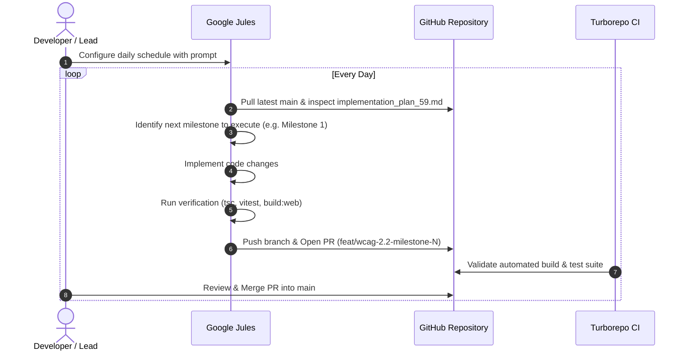

# Google Jules Scheduled Prompt: Daily WCAG 2.2 Level AA Execution

## Overview

This guide provides the complete configuration and structured prompt to run **Google Jules** on a recurring daily schedule. It allows the agent to autonomously and iteratively implement the four milestones of the **WCAG 2.2 Level AA Compliance Roadmap** ([`apps/console/doc/implementation_plan_59.md`](file:///c:/Users/Admin/workspace/git/unipost/apps/console/doc/implementation_plan_59.md)) with automated verification, pull request creation, and zero regression.

---

## 1. Google Jules Configuration

| Setting | Recommended Value | Notes |
| :--- | :--- | :--- |
| **Schedule / Trigger** | Daily (Recurring, e.g. 02:00 UTC) | Runs autonomously overnight |
| **Target Branch** | `main` | Jules branches off `main` for each iteration |
| **PR Strategy** | Create Branch & Pull Request | `feat/wcag-2.2-milestone-<N>` |
| **Assigned Reviewer** | Lead Systems Architect / Tech Lead | Human approval before merging to `main` |

---

## 2. Scheduled Prompt (Copy-Paste into Jules)

```markdown
# Autonomous Task: Iterative WCAG 2.2 AA Compliance Engine

You are an expert Frontend Systems Architect & Accessibility Engineer working on the `unipost` monorepo.
Your objective for this scheduled daily run is to make incremental, fully verified progress on achieving **WCAG 2.2 Level AA compliance** across `@unipost/console` and `@unipost/ui`.

---

### 1. Context & Authoritative Source of Truth
- **Plan File**: Read `apps/console/doc/implementation_plan_59.md` before taking any action.
- **Rules Reference**: Adhere strictly to `.agents/rules/00-generic-common.md` and `.agents/rules/01-workspace-specific.md`.
- **Target Applications**:
  - `@unipost/console` (`apps/console`)
  - `@unipost/ui` (`packages/ui`)
- **Key Invariants**:
  1. **Do not break the Liquid Glass aesthetic** (frosted scrims, specular borders, backdrop blurs).
  2. **Do not break the Bento Box layout** on medium/large screens (pinned `100svh` desktop viewports with internal pane scrolling must remain functional).
  3. **Zero regression** on existing features, tests, and the Unified Sandbox platform.

---

### 2. Daily Iterative Execution Strategy (Pick Exactly ONE Phase per Day)
Do NOT try to complete all milestones in a single run. Instead, determine current completion state by inspecting previous commits or `apps/console/doc/walkthrough_59.md`, and execute **only the next uncompleted milestone/task**:

- **Milestone 1 (Design Tokens & Contrast Hardening)**:
  - Calibrate `--muted-foreground` in `apps/console/src/styles/theme.css` to guarantee ≥ 4.5:1 text contrast on light/dark glass scrims.
  - Implement global `scroll-padding-top: calc(var(--header-height, 4rem) + 1rem)` in `apps/console/src/styles/index.css` to satisfy SC 2.4.11 (Focus Not Obscured).
  - Enforce minimum pointer target sizing (≥ 28×28px) on icon buttons and pagination triggers (SC 2.5.8).

- **Milestone 2 (Navigation, Landmarks & Bypass Blocks)**:
  - Wire the disconnected skip link: Ensure `<SkipToMain>` points to an element with `id="content"` and `tabIndex={-1}` on `Main` (`apps/console/src/components/layout/main.tsx`).
  - Standardize ARIA landmark regions (`<header role="banner">`, `<nav aria-label="...">`, `<aside aria-label="...">`).
  - Enforce strict `h1` → `h2` → `h3` heading hierarchy without skipped levels across core screens.

- **Milestone 3 (Dynamic Features, Data Tables & Complex Interactions)**:
  - In `EntityDataGrid` (`apps/console/src/features/metadata/components/data-explorer/entity-data-grid.tsx`): Add `scope="col"`, `aria-sort`, and descriptive `aria-label`s on icon buttons.
  - In `SchemaBuilder` (`apps/console/src/features/metadata/components/schema-builder/`): Provide single-pointer/keyboard reordering alternatives ("Move Up" / "Move Down" buttons) to satisfy SC 2.5.7 (Dragging Movements).
  - Verify auth and OTP forms allow paste events and standard autocomplete hints (SC 3.3.8).

- **Milestone 4 (Automated Testing & Governance Pipeline)**:
  - Configure `eslint-plugin-jsx-a11y` in `@unipost/console`.
  - Add `vitest-axe` component accessibility assertions to test suites.
  - Ensure `pnpm test` runs axe checks with zero violations.

---

### 3. Verification Protocol (MANDATORY Before Committing)
You must run the following checks and ensure they pass with 0 errors:
1. `pnpm --filter @unipost/console exec tsc -b`
2. `pnpm --filter @unipost/console test`
3. `pnpm --filter @unipost/console build:web`

---

### 4. Git Archival & Reporting Instructions
Once verified:
1. Create or update the paired walkthrough: `apps/console/doc/walkthrough_59.md`.
2. Create sequential history log: `docs/history/XXX_wcag_2_2_compliance.md` and update `docs/history/README.md`.
3. Commit using Conventional Commits:
   `git commit -m "feat(a11y): [XXX] implement WCAG 2.2 AA Milestone <N>" -m "Brief summary of milestone achievements"`
4. In your final report, output:
   - What specific milestone/sub-task was implemented today.
   - Verification command results.
   - Exactly what remains for tomorrow's run.
```

---

## 3. Iterative Progression Workflow



---

## 4. State Management Across Daily Iterations

Jules determines which milestone to execute each day through the following heuristic:
1. **Milestone 1 Complete?** Checks if `--muted-foreground` in `theme.css` has lightness `< 0.5` and `scroll-padding-top` is in `index.css`. If not, executes Milestone 1.
2. **Milestone 2 Complete?** Checks if `Main` in `main.tsx` has `id="content"` and `tabIndex={-1}`. If not, executes Milestone 2.
3. **Milestone 3 Complete?** Checks if `EntityDataGrid` has `scope="col"` and `aria-sort`. If not, executes Milestone 3.
4. **Milestone 4 Complete?** Checks if `vitest-axe` is configured in `package.json`. If not, executes Milestone 4.
5. **All Complete?** Reports that the WCAG 2.2 AA roadmap is 100% complete and runs full regression audit.
