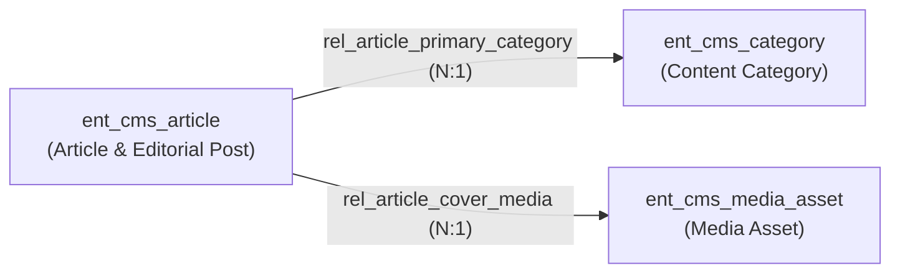
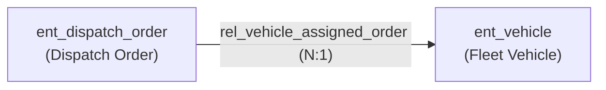
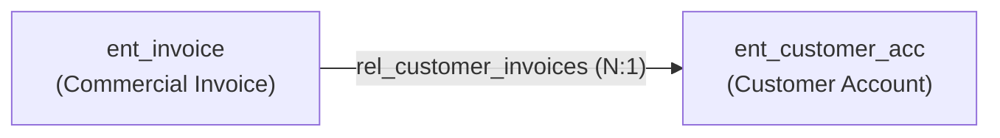

# Domain Blueprints Architecture: Declarative Catalog, Atomic Provisioning & Decoupled Schema Evolution

**System Level:** Core Architecture & Platform Engineering Specification  
**Target Systems:** `@unipost/backend` (Spring Modulith / Java 21 / PostgreSQL 16+), `@unipost/console` (React 19 / Vite 8 / TanStack Router)  
**Authoritative Location:** `docs/multi-tenants/domain_blueprints_reference.md`  
**Status:** Canonical Reference Document  

---

## 1. Executive Summary & Core Philosophy

In a high-density, multi-tenant dynamic metadata platform, onboarding a new organization onto a blank workspace ("the empty canvas problem") leads to high friction and slow time-to-value. Conversely, baking domain-specific entities (such as fleet vehicles, commercial invoices, or editorial articles) directly into hardcoded database schemas destroys platform modularity and creates cross-tenant upgrade locks.

To solve this, Unipost introduces **Domain Blueprints**:
* **Declarative JSON Templates:** Versioned, industry-specific schemas declaring entity models, attributes, UI components, validation constraints, and graph relationship edges.
* **Atomic Provisioning Pipeline:** Onboarding executes an atomic transactional deep-clone that stamps every newly created model, attribute, and relationship edge with the tenant's cryptographic `tenant_id` and baseline `schema_version = 1L`.
* **Zero Runtime Linkage ("Decoupled Schema Evolution"):** Once cloned into the tenant's workspace, models sever all linkage to the original blueprint JSON. The tenant possesses 100% autonomy to mutate, extend, or delete schemas without affecting the global template catalog or other tenants.
* **$< 250ms Distributed Cache Pre-Warming:** Provisioning immediately compiles Draft-07 JSON Schemas and seeds them synchronously into both in-memory L1 cache and Hazelcast distributed maps, guaranteeing zero cold-start latency on the tenant's very first record ingestion.

```
┌────────────────────────────────────────────────────────────────────────────────────────┐
│                              DOMAIN BLUEPRINT LIFECYCLE                                │
├────────────────────────────────────────────────────────────────────────────────────────┤
│  1. Manifest Discovery  ──► Classpath Scanning (metadata/blueprints/*.json)            │
│  2. Catalog Registry    ──► BlueprintCatalogService in-memory caching                  │
│  3. REST Catalog API    ──► GET /api/v1/metadata/blueprints (UI Template Picker)        │
│  4. Atomic Provisioning ──► POST /api/v1/metadata/tenants/provision                    │
│                              │                                                         │
│                              ├─ Deep-clone EntityTypes (stamped with target tenant_id) │
│                              ├─ Deep-clone AttributeDefinitions with UI components     │
│                              ├─ Wire RelationshipTypes (source/target foreign keys)   │
│                              └─ Synchronously pre-warm Hazelcast & L1 schema cache     │
│  5. Independent Evolve  ──► Tenant mutates schemas via Architect Studio (Zero Linkage) │
└────────────────────────────────────────────────────────────────────────────────────────┘
```

---

## 2. Blueprint Architectural Invariants

### Invariant 1: Blueprint vs. System Schema Separation
It is critical to distinguish between **Common System Schemas** and **Domain Blueprints**:

| Dimension | Common System Schemas (`tenant_id = 'SYSTEM'`) | Domain Starter Blueprints (`bp_*`) |
| :--- | :--- | :--- |
| **Origin** | Hardcoded platform core entities (`User`, `CustomerAccount`). | Declarative JSON manifests in `metadata/blueprints/`. |
| **Cloning Behavior** | **Never cloned.** Shared across all tenants. | **Deep-cloned** per tenant into `UNIPOST_ENTITY_TYPES`. |
| **Tenant Ownership** | Read-only base schema with custom overlay fields. | 100% tenant-owned bespoke models. |
| **Immutability Guard** | Protected against deletion, rename, or archiving. | Tenant administrators can alter, rename, or delete freely. |
| **Cache Key** | Merged into composite keys: `schema:{tid}:{id}:v{tVer}_s1`. | Standard composite keys: `schema:{tid}:{id}:v1_s1`. |

### Invariant 2: Decoupled Schema Evolution
Once provisioned:
1. Each cloned `EntityType` receives a unique database primary key (`BIGINT id`) and its own `schema_version = 1L`.
2. No foreign key or relational constraint exists between the provisioned entity and the blueprint identifier.
3. If the platform updates a blueprint JSON file in a future deployment, already provisioned tenants are **never retroactively modified**, preventing breaking changes to production workloads.

### Invariant 3: Tenant Security & Auditing Context Stamping
The provisioning service must enforce strict tenant boundaries:
1. Provisions execute in a `@Transactional` block.
2. `TenantContextHolder.setTenantId(targetTenantId)` is set for the duration of the method and cleared in a `finally` block.
3. Every cloned record (`UNIPOST_ENTITY_TYPES`, `UNIPOST_ATTRIBUTE_DEFINITIONS`, `UNIPOST_RELATIONSHIP_TYPES`) is explicitly stamped with `tenant_id = :targetTenantId`.
4. PostgreSQL Row-Level Security (RLS) policies (`FORCE ROW LEVEL SECURITY`) immediately isolate these records so only authenticated JWT tokens containing `tid == targetTenantId` can access them.

---

## 3. Blueprint Manifest Specification

Domain blueprints are defined as JSON files stored in `apps/backend/unipost-fw/src/main/resources/metadata/blueprints/`.

### 3.1 JSON Schema Structure

```json
{
  "$schema": "https://json-schema.org/draft-07/schema#",
  "title": "BlueprintManifest",
  "type": "object",
  "required": ["id", "name", "category", "description", "icon", "entityTypes"],
  "properties": {
    "id": { "type": "string", "pattern": "^bp_[a-z0-9_]+$" },
    "name": { "type": "string" },
    "category": { "type": "string" },
    "description": { "type": "string" },
    "icon": { "type": "string" },
    "entityTypes": {
      "type": "array",
      "items": {
        "type": "object",
        "required": ["systemName", "name", "attributes"],
        "properties": {
          "systemName": { "type": "string" },
          "name": { "type": "string" },
          "description": { "type": "string" },
          "attributes": {
            "type": "array",
            "items": {
              "type": "object",
              "required": ["systemName", "name", "dataType", "uiComponent"],
              "properties": {
                "systemName": { "type": "string" },
                "name": { "type": "string" },
                "dataType": { "type": "string", "enum": ["STRING", "INTEGER", "DECIMAL", "BOOLEAN", "DATE", "JSON"] },
                "uiComponent": { "type": "string", "enum": ["text", "textarea", "number", "select", "switch", "date_picker"] },
                "isRequired": { "type": "boolean" },
                "displayOrder": { "type": "integer" },
                "defaultValue": { "type": "string" },
                "options": { "type": "object" }
              }
            }
          }
        }
      }
    },
    "relationshipTypes": {
      "type": "array",
      "items": {
        "type": "object",
        "required": ["systemName", "name", "sourceEntityType", "targetEntityType", "cardinality"],
        "properties": {
          "systemName": { "type": "string" },
          "name": { "type": "string" },
          "description": { "type": "string" },
          "sourceEntityType": { "type": "string" },
          "targetEntityType": { "type": "string" },
          "cardinality": { "type": "string", "enum": ["ONE_TO_ONE", "ONE_TO_MANY", "MANY_TO_ONE", "MANY_TO_MANY"] }
        }
      }
    }
  }
}
```

---

## 4. Pre-Packaged Domain Blueprint Catalog

The platform currently ships with 4 production-grade blueprints out of the box:

### 4.1 Headless CMS & Digital Publishing (`bp_cms_publishing_v1`)
Designed for editorial teams, digital magazines, corporate newsrooms, and multi-channel content engines.



* **Models & Attributes:**
  * **`ent_cms_article` (Article & Editorial Post):**
    * `title` (`STRING`, `text`, required)
    * `slug` (`STRING`, `text`, required)
    * `summary` (`STRING`, `textarea`)
    * `body_content` (`STRING`, `textarea`, required)
    * `status` (`STRING`, `select`, default: `DRAFT`, choices: `["DRAFT", "IN_REVIEW", "SCHEDULED", "PUBLISHED", "ARCHIVED"]`)
    * `featured_flag` (`BOOLEAN`, `switch`, default: `false`)
    * `meta_title` (`STRING`, `text`)
    * `meta_description` (`STRING`, `textarea`)
  * **`ent_cms_category` (Content Category):**
    * `category_name` (`STRING`, `text`, required)
    * `slug` (`STRING`, `text`, required)
    * `description` (`STRING`, `textarea`)
  * **`ent_cms_media_asset` (Media Asset):**
    * `asset_title` (`STRING`, `text`, required)
    * `asset_url` (`STRING`, `text`, required)
    * `media_type` (`STRING`, `select`, default: `IMAGE_WEBP`, choices: `["IMAGE_JPEG", "IMAGE_PNG", "IMAGE_WEBP", "VIDEO_MP4", "DOCUMENT_PDF"]`)
    * `alt_text` (`STRING`, `text`)
* **Relationship Edges:**
  * `rel_article_primary_category`: `ent_cms_article` $\rightarrow$ `ent_cms_category` (`MANY_TO_ONE`).
  * `rel_article_cover_media`: `ent_cms_article` $\rightarrow$ `ent_cms_media_asset` (`MANY_TO_ONE`).

---

### 4.2 Logistics & Fleet Management (`bp_logistics_v1`)
Designed for freight carriers, commercial dispatchers, and last-mile delivery fleets.



* **Models & Attributes:**
  * **`ent_vehicle` (Fleet Vehicle):**
    * `license_plate` (`STRING`, `text`, required)
    * `vehicle_type` (`STRING`, `select`, required, choices: `["VAN", "BOX_TRUCK", "SEMI_TRAILER", "ELECTRIC_CARGO"]`)
    * `max_payload_kg` (`INTEGER`, `number`)
    * `is_active` (`BOOLEAN`, `switch`, default: `true`)
  * **`ent_dispatch_order` (Dispatch Order):**
    * `tracking_number` (`STRING`, `text`, required)
    * `delivery_status` (`STRING`, `select`, required, choices: `["SCHEDULED", "IN_TRANSIT", "DELIVERED", "FAILED"]`)
    * `destination_address` (`STRING`, `textarea`, required)
* **Relationship Edges:**
  * `rel_vehicle_assigned_order`: `ent_dispatch_order` $\rightarrow$ `ent_vehicle` (`MANY_TO_ONE`).

---

### 4.3 B2B CRM & Invoicing (`bp_crm_billing_v1`)
Designed for agency client management, SaaS customer subscriptions, and commercial billing.



* **Models & Attributes:**
  * **`ent_customer_acc` (Customer Account):**
    * `company_name` (`STRING`, `text`, required)
    * `tax_id` (`STRING`, `text`)
    * `tier` (`STRING`, `select`, required, choices: `["STANDARD", "PREMIUM", "ENTERPRISE"]`)
    * `billing_email` (`STRING`, `text`, required)
  * **`ent_invoice` (Commercial Invoice):**
    * `invoice_number` (`STRING`, `text`, required)
    * `total_amount` (`DECIMAL`, `number`, required)
    * `currency` (`STRING`, `select`, default: `VND`, choices: `["VND", "USD", "EUR", "SGD"]`)
    * `status` (`STRING`, `select`, default: `DRAFT`, choices: `["DRAFT", "ISSUED", "PAID", "VOID"]`)
* **Relationship Edges:**
  * `rel_customer_invoices`: `ent_invoice` $\rightarrow$ `ent_customer_acc` (`MANY_TO_ONE`).

---

### 4.4 Blank Workspace (`bp_blank_v1`)
Designed for custom system architects who prefer building models completely from scratch.
* **Entities:** 0
* **Attributes:** 0
* **Relationships:** 0

---

## 5. Backend Implementation Mechanics

### 5.1 Dynamic Discovery (`BlueprintCatalogService`)
On application initialization (`@PostConstruct`), `BlueprintCatalogService` utilizes Spring's `PathMatchingResourcePatternResolver`:

```java
PathMatchingResourcePatternResolver resolver = new PathMatchingResourcePatternResolver();
Resource[] resources = resolver.getResources("classpath:metadata/blueprints/*.json");
for (Resource resource : resources) {
    try (InputStream is = resource.getInputStream()) {
        BlueprintManifest manifest = objectMapper.readValue(is, BlueprintManifest.class);
        blueprintCatalog.put(manifest.id(), manifest);
    }
}
```
* **Performance:** Discovering and parsing all manifests consumes $< 15\text{ ms}$ at application boot.
* **Zero Database Queries:** Blueprints exist in the application classpath and memory cache, leaving the relational database uncluttered.

### 5.2 Atomic Provisioning Pipeline (`TenantProvisioningService`)
When `POST /api/v1/metadata/tenants/provision` is invoked:

```java
@Transactional
public TenantProvisioningResult provisionTenant(TenantProvisioningRequest request) {
    long startTime = System.currentTimeMillis();
    String targetTenantId = request.tenantId().trim().toLowerCase();
    
    // 1. Resolve blueprint manifest
    BlueprintManifest manifest = blueprintCatalogService.getBlueprint(request.blueprintId())
        .orElseThrow(() -> new MetadataNotFoundException("Unknown blueprint: " + request.blueprintId()));

    // 2. Set tenant security context
    String previousTenant = TenantContextHolder.getTenantId();
    TenantContextHolder.setTenantId(targetTenantId);

    try {
        Map<String, EntityType> createdEntities = new HashMap<>();

        // 3. Deep-clone EntityTypes
        for (BlueprintEntityType bType : manifest.entityTypes()) {
            if (entityTypeRepository.existsBySystemNameAndDeletedDateIsNull(bType.systemName())) {
                throw new MetadataConflictException("EntityType '" + bType.systemName() + "' already exists");
            }

            EntityType et = new EntityType();
            et.setTenantId(targetTenantId);
            et.setName(bType.name());
            et.setSystemName(bType.systemName());
            et.setDescription(bType.description());
            et.setSchemaVersion(1L);
            EntityType savedEt = entityTypeRepository.save(et);
            createdEntities.put(savedEt.getSystemName(), savedEt);

            // 4. Deep-clone AttributeDefinitions
            for (BlueprintAttribute bAttr : bType.attributes()) {
                AttributeDefinition attr = new AttributeDefinition();
                attr.setTenantId(targetTenantId);
                attr.setEntityType(savedEt);
                attr.setName(bAttr.name());
                attr.setSystemName(bAttr.systemName());
                attr.setDataType(bAttr.dataType());
                attr.setUiComponent(bAttr.uiComponent());
                attr.setIsRequired(Boolean.TRUE.equals(bAttr.isRequired()));
                attr.setDisplayOrder(bAttr.displayOrder() != null ? bAttr.displayOrder() : 0);
                attr.setDefaultValue(bAttr.defaultValue());
                attr.setOptions(bAttr.options());
                attributeDefinitionRepository.save(attr);
            }

            // 5. Synchronously Pre-warm Schema Cache
            schemaValidationService.getOrCompileJsonSchema(targetTenantId, savedEt.getId(), 1L);
        }

        // 6. Deep-clone Relationship Types
        for (BlueprintRelationship bRel : manifest.relationshipTypes()) {
            EntityType source = createdEntities.get(bRel.sourceEntityType());
            EntityType target = createdEntities.get(bRel.targetEntityType());

            RelationshipType rel = new RelationshipType();
            rel.setTenantId(targetTenantId);
            rel.setSystemName(bRel.systemName());
            rel.setDescription(bRel.description());
            rel.setSourceEntityType(source);
            rel.setTargetEntityType(target);
            rel.setCardinality(bRel.cardinality() != null ? bRel.cardinality() : "MANY_TO_MANY");
            relationshipTypeRepository.save(rel);
        }

        return new TenantProvisioningResult(
            targetTenantId, request.tenantName(), manifest.id(), manifest.name(),
            createdEntities.size(), totalAttrs, totalRels, entityNames,
            System.currentTimeMillis() - startTime
        );
    } finally {
        if (previousTenant != null) {
            TenantContextHolder.setTenantId(previousTenant);
        } else {
            TenantContextHolder.clear();
        }
    }
}
```

---

## 6. Distributed Cache Fabric Pre-Warming

A critical architectural flaw in generic dynamic metadata platforms is **first-request cold-start penalty**:
1. When an operator attempts to create a record immediately after onboarding, the engine normally has to query all attribute definitions from PostgreSQL.
2. It then constructs a JSON Schema string and compiles it into a `com.networknt.schema.JsonSchema` validator object.
3. This creates a $> 300\text{ ms}$ latency spike on the first API call.

### The Unipost Solution: Pre-Warming Invariant
During Step 5 of the provisioning pipeline:
* `SchemaValidationService.getOrCompileJsonSchema(tenantId, entityTypeId, 1L)` is called synchronously for every provisioned entity.
* It resolves the effective attributes, builds the Draft-07 schema JSON, and stores it in Hazelcast's `metadata-schemas` distributed map under the composite key:
  $$\text{Key} = \text{schema}:\{\text{tenant\_id}\}:\{\text{entity\_type\_id}\}:\text{v}1\_\text{s}1$$
* It also caches the compiled Java object in the local node's in-memory L1 cache (`ConcurrentHashMap`).
* **Result:** Initial record creation latency drops from $300\text{ ms}$ to $< 2\text{ ms}$.

---

## 7. REST API Endpoints & Developer Guide

### 7.1 List Available Blueprints
Retrieves all discovered templates for onboarding wizards or selection dialogs.

* **Method:** `GET`
* **Path:** `/api/v1/metadata/blueprints`
* **Permission:** `hasAuthority('METADATA_SCHEMA_READ') or hasRole('ADMIN')`
* **Response Example:**
```json
{
  "code": "200",
  "data": [
    {
      "id": "bp_cms_publishing_v1",
      "name": "Headless CMS & Digital Publishing",
      "category": "MEDIA_PUBLISHING",
      "description": "Multi-channel content authoring, articles, category taxonomy, SEO metadata, and media asset management.",
      "icon": "Newspaper",
      "entityTypesCount": 3,
      "relationshipsCount": 2
    },
    {
      "id": "bp_logistics_v1",
      "name": "Logistics & Fleet Management",
      "category": "SUPPLY_CHAIN",
      "description": "Commercial vehicle tracking, dispatch orders, and vehicle assignments.",
      "icon": "Truck",
      "entityTypesCount": 2,
      "relationshipsCount": 1
    },
    {
      "id": "bp_crm_billing_v1",
      "name": "B2B CRM & Invoicing",
      "category": "FINANCE_CRM",
      "description": "Customer account management, tax profiles, and recurring sales invoicing.",
      "icon": "Briefcase",
      "entityTypesCount": 2,
      "relationshipsCount": 1
    },
    {
      "id": "bp_blank_v1",
      "name": "Blank Workspace",
      "category": "GENERAL",
      "description": "Clean slate workspace with zero predefined models.",
      "icon": "Layers",
      "entityTypesCount": 0,
      "relationshipsCount": 0
    }
  ]
}
```

### 7.2 Provision Tenant Workspace
Provisions a new or existing tenant with the selected blueprint template.

* **Method:** `POST`
* **Path:** `/api/v1/metadata/tenants/provision`
* **Permission:** `hasAuthority('METADATA_SCHEMA_WRITE') or hasRole('ADMIN')`
* **Request Payload:**
```json
{
  "tenantId": "tnt_speedy_dispatch",
  "tenantName": "Speedy Dispatch Logistics",
  "blueprintId": "bp_logistics_v1"
}
```
* **Response Example:**
```json
{
  "code": "200",
  "data": {
    "tenantId": "tnt_speedy_dispatch",
    "tenantName": "Speedy Dispatch Logistics",
    "blueprintId": "bp_logistics_v1",
    "blueprintName": "Logistics & Fleet Management",
    "createdEntityTypesCount": 2,
    "createdAttributesCount": 7,
    "createdRelationshipsCount": 1,
    "createdEntityTypeNames": ["Fleet Vehicle", "Dispatch Order"],
    "executionTimeMs": 142
  }
}
```

---

## 8. Authoring New Domain Blueprints: SOP

To add a new blueprint to the platform (e.g. *Healthcare Clinic Records* or *Warehouse Inventory*), follow this standard procedure:

1. **Create the Manifest File:**
   * Create `apps/backend/unipost-fw/src/main/resources/metadata/blueprints/<domain>-blueprint.json`.
   * Ensure `id` starts with `bp_` and ends with version (e.g., `bp_clinic_v1`).
   * Select a Lucide icon string (e.g., `Stethoscope`, `Package`, `Box`).
2. **Define Entity Types & System Names:**
   * Ensure all `systemName` tokens use lowercase snake_case prefixed by `ent_` (e.g., `ent_patient`, `ent_appointment`).
   * Keep names user-friendly (e.g., `Patient Medical Record`).
3. **Configure Field Attributes:**
   * Choose standard data types (`STRING`, `INTEGER`, `DECIMAL`, `BOOLEAN`, `DATE`).
   * Specify form UI components (`text`, `textarea`, `number`, `select`, `switch`).
   * When using `select`, provide `options.choices` array.
4. **Define Relationships:**
   * Ensure `sourceEntityType` and `targetEntityType` match the declared `systemName` values.
   * Provide an explicit cardinality (`MANY_TO_ONE`, `ONE_TO_MANY`, `MANY_TO_MANY`).
5. **Verify Discovery & Execution:**
   * Run the test suite: `mvn test -Dtest=TenantProvisioningServiceTest`.
   * The resolver automatically scans and caches the new blueprint with zero manual registration needed in Java.

---

## 9. Summary & Cross-References

| Concept | File Location | Key Responsibility |
| :--- | :--- | :--- |
| **Blueprint Manifests** | `apps/backend/unipost-fw/src/main/resources/metadata/blueprints/*.json` | Declarative templates for domain entities and edges. |
| **Catalog Service** | [`BlueprintCatalogService.java`](file:///c:/Users/Admin/workspace/git/unipost/apps/backend/unipost-fw/src/main/java/com/unipost/tenant/blueprint/BlueprintCatalogService.java) | Classpath scanning and memory caching of blueprints. |
| **Provisioning Service**| [`TenantProvisioningService.java`](file:///c:/Users/Admin/workspace/git/unipost/apps/backend/unipost-fw/src/main/java/com/unipost/tenant/service/TenantProvisioningService.java) | Atomic deep-cloning, tenant stamping, and cache pre-warming. |
| **REST Controller** | [`TenantProvisioningController.java`](file:///c:/Users/Admin/workspace/git/unipost/apps/backend/unipost-fw/src/main/java/com/unipost/presentation/TenantProvisioningController.java) | Public API endpoints for catalog discovery and provisioning. |
| **Verification Suite** | [`TenantProvisioningServiceTest.java`](file:///c:/Users/Admin/workspace/git/unipost/apps/backend/unipost-fw/src/test/java/com/unipost/tenant/service/TenantProvisioningServiceTest.java) | Automated unit tests covering all blueprints and edge cases. |
