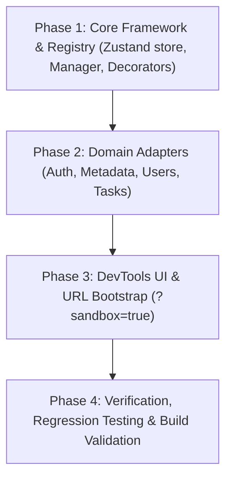

# Unified Application Sandbox Architecture & Implementation Plan

> **Version:** 1.0.0  
> **Author:** Antigravity Architect  
> **Target Package:** `@unipost/console` (`apps/console`)  
> **Scope:** Full-Application Unified Mock Data & Authentication Sandbox  
> **Status:** Proposed / Ready for Implementation  

---

## 1. Executive Summary & Problem Statement

Currently, mock and sandbox capabilities across `@unipost/console` are fragmented across isolated implementations:
1. **Authentication Sandbox (`features/spring-auth`)**: Intercepts `/auth/token`, `/auth/refresh`, `/auth/logout`, and `/admin/dashboard` using custom Axios request interceptors and token inspection.
2. **Metadata Platform Mock Engine (`features/metadata`)**: An in-memory store (`mockMetadataStore`) backing PostgreSQL JSONB containment, two-tier cache simulations, schema drift analysis, and backfill. Switched via `VITE_METADATA_MOCK` and the Strategy pattern.
3. **Task & User Fixtures (`features/tasks`, `features/users`)**: Static in-memory arrays in `data/tasks.ts` and `data/users.ts` with no unified lifecycle, mutation persistence, or reset mechanism.
4. **Third-Party Integrations (`features/apps`)**: Modals (Facebook, YouTube) using hardcoded inline simulated responses.

### Key Deficiencies
- **Context Fragmentation**: Logging in as a sandbox user (e.g. `creator_bypass`) does not automatically correlate with metadata tenant segregation, assigned tasks, or user profile records.
- **Scattered Activation**: Enabling/disabling mocks requires modifying multiple environment variables and code paths.
- **No Shared Network Simulation**: Inability to test network jitter, latency degradation, or HTTP 429/500 fault injection uniformly across features.
- **Lack of Persistent State in Dev**: Mock edits are lost on browser refresh unless explicitly preserved.

---

## 2. Core Architectural Guarantees & Constraints

### 2.1 Non-Breaking Backward Compatibility Guarantee
> [!IMPORTANT]
> **Zero Breaking Changes Principle:**
> Any new sandbox handler, repository, adapter, or interceptor introduced **must NOT break existing code paths, singletons, or test suites**.
> 1. All existing mock singletons (`mockMetadataStore`, `enableSandboxMockEngine`) remain fully accessible with their existing signatures.
> 2. Existing test suites (such as `metadata-workflows.test.ts` and auth unit tests) will pass without modification.
> 3. Production builds (`pnpm --filter @unipost/console build`) must produce clean, tree-shakable artifacts without leaking dev sandbox logic into production bundles unless explicitly enabled.

---

## 3. Design Pattern Architecture

The Unified Sandbox Platform leverages 5 industry-standard design patterns to achieve loose coupling, modularity, and high maintainability:

```
┌────────────────────────────────────────────────────────────────────────────────────────┐
│                                 Sandbox Control Layer                                   │
│    [Unified Sandbox Store (Zustand)] <──> [DevTools Dock UI & URL Params (?sandbox)]   │
└──────────────────────────────────────────┬─────────────────────────────────────────────┘
                                           │ drives state & policies
                                           ▼
┌────────────────────────────────────────────────────────────────────────────────────────┐
│                        Unified Sandbox Manager (Facade Pattern)                        │
│   Single API surface for Persona switching, Tenant context, Reset, and Diagnostics     │
└──────────────────────────────────────────┬─────────────────────────────────────────────┘
                                           │
         ┌─────────────────────────────────┼─────────────────────────────────┐
         ▼                                 ▼                                 ▼
┌───────────────────────┐       ┌─────────────────────────┐       ┌──────────────────────┐
│  Auth Sandbox Handler │       │ Metadata Sandbox Adapter│       │ User/Task Repository │
│  (Wraps mock-engine)  │       │(Adapts mockMetadataStore│       │ (In-memory CRUD)     │
└───────────────────────┘       └─────────────────────────┘       └──────────────────────┘
         │                                 │                                 │
         └─────────────────────────────────┼─────────────────────────────────┘
                                           ▼
┌────────────────────────────────────────────────────────────────────────────────────────┐
│                    Sandbox Handler Registry (Registry Pattern)                         │
│                  Dispatches incoming requests matching route patterns                  │
└──────────────────────────────────────────┬─────────────────────────────────────────────┘
                                           │
                                           ▼
┌────────────────────────────────────────────────────────────────────────────────────────┐
│              Network Interceptor & Simulation Decorator (Decorator Pattern)            │
│  - Evaluates matching handlers; unhandled requests pass through to live network        │
│  - withSimulatedLatency(minMs, maxMs)                                                  │
│  - withFaultInjection(errorRate, statusCodes)                                          │
└────────────────────────────────────────────────────────────────────────────────────────┘
```

### 1. Facade Pattern (`UnifiedSandboxManager`)
Provides a single, cohesive control interface for the whole application:
- `sandbox.enable(options)` / `sandbox.disable()`
- `sandbox.switchPersona(personaId)`
- `sandbox.switchTenant(tenantId)`
- `sandbox.setLatency(ms)`
- `sandbox.resetAllData()`

### 2. Adapter Pattern (`MetadataSandboxAdapter`)
Instead of refactoring the comprehensive `mockMetadataStore` in `mock-metadata.ts` (which is battle-tested by 14 workflow tests), an adapter wraps it to satisfy the `SandboxRouteHandler` contract. Existing callers continue to consume `mockMetadataStore` directly without regression.

### 3. Registry & Service Locator Pattern (`SandboxRegistry`)
Allows each domain to register routes and handlers independently:
```typescript
SandboxRegistry.register({
  id: 'auth-routes',
  matcher: (url, method) => url.startsWith('/auth/'),
  handler: authSandboxHandler,
});
```
Unmatched routes automatically fall through to the live network.

### 4. Decorator Pattern (`withSimulationDecorator`)
Wraps any sandbox response transparently with:
- **Simulated Latency**: Adds jittered delays to test loading skeletons and spinners.
- **Fault Injection**: Randomly returns HTTP 429, 500, or 503 based on configured probabilities to test error boundaries.

### 5. Strategy Pattern (`SandboxDataSourceStrategy<T>`)
Preserves runtime flexibility between Live HTTP and Sandbox modes per domain.

---

## 4. Directory Structure

```
apps/console/src/core/sandbox/
├── index.ts                         # Public API exports
├── types.ts                         # Handler, Request, Response, and Persona interfaces
├── store/
│   └── sandbox-store.ts             # Zustand store for sandbox state (persona, latency, etc.)
├── manager/
│   ├── sandbox-manager.ts           # UnifiedSandboxManager (Facade)
│   ├── sandbox-registry.ts          # Registry for pluggable domain handlers
│   └── decorators/
│       ├── latency-decorator.ts     # Network delay simulation
│       └── fault-decorator.ts       # Chaos / error injection simulation
├── adapters/
│   ├── axios-sandbox-adapter.ts     # Axios interceptor / adapter with fallthrough
│   └── fetch-sandbox-adapter.ts     # Window.fetch wrapper (if needed)
├── handlers/
│   ├── auth-sandbox-handler.ts      # Migrated / adapted auth mock handler
│   ├── metadata-sandbox-adapter.ts  # Adapter bridging mockMetadataStore
│   ├── users-sandbox-handler.ts     # In-memory users CRUD repository
│   └── tasks-sandbox-handler.ts     # In-memory tasks CRUD repository
└── ui/
    ├── sandbox-dock.tsx             # Floating DevTools toggle dock
    ├── persona-selector.tsx         # Persona quick switcher (Admin, Creator, etc.)
    └── network-controls.tsx         # Latency and error rate sliders
```

---

## 5. Domain Personas & Seed Synchronization

To guarantee end-to-end coherence across all domains, predefined Personas will align roles, permissions, and tenant data:

| Persona ID | Username | Roles | Default Tenant | Correlated Seed Data |
| :--- | :--- | :--- | :--- | :--- |
| `admin` | `admin_bypass` | `ROLE_USER`, `ROLE_ADMIN` | `tenant-us-east-1` | Access to all entity types, schema migrations, and admin telemetry. |
| `creator` | `creator_bypass` | `ROLE_USER`, `ROLE_CREATOR` | `tenant-eu-central-1` | Data explorer authoring, schema draft creation. |
| `user` | `user_bypass` | `ROLE_USER` | `tenant-us-west-2` | Read-only record exploration, standard tasks. |

When a persona is switched:
1. Active JWT access & refresh tokens update in `useSpringAuthStore`.
2. Active Tenant ID updates globally in `useSandboxStore`.
3. Metadata explorer default tenant filter syncs with the persona's tenant.

---

## 6. Phased Implementation Roadmap



### Phase 1: Core Sandbox Framework & Registry
- [ ] Create `apps/console/src/core/sandbox/types.ts` defining contracts for handlers, requests, responses, and personas.
- [ ] Create `useSandboxStore` (Zustand) with local storage sync for developer persistence.
- [ ] Create `SandboxRegistry` and `UnifiedSandboxManager` supporting route pattern matching and fall-through.
- [ ] Implement `withSimulatedLatency` and `withFaultInjection` decorators.

### Phase 2: Domain Handlers & Adapters (Non-Breaking)
- [ ] **Auth Sandbox Handler**: Extract core token and endpoint generation logic into `auth-sandbox-handler.ts`. Maintain backward compatibility in `spring-auth/sandbox/mock-engine.ts`.
- [ ] **Metadata Sandbox Adapter**: Implement `metadata-sandbox-adapter.ts` delegating to `mockMetadataStore`. Keep `mock-metadata.ts` intact for test compatibility.
- [ ] **Users & Tasks Repositories**: Wrap static datasets into reactive in-memory stores with CRUD capabilities.
- [ ] **Axios Sandbox Adapter**: Integrate with `springApiClient` ensuring requests cleanly fall through to real network when sandbox is disabled or endpoint is unregistered.

### Phase 3: Developer Experience & UI Controls
- [ ] Create `SandboxDock` component rendered conditionally in DEV mode or when `?sandbox=true` is present in URL.
- [ ] Add controls for Persona Switching, Tenant Switching, Latency Slider, and Master Data Reset.
- [ ] Add URL parameter parser to auto-configure sandbox state (ideal for automated E2E tests).

### Phase 4: Quality Assurance & Zero-Regression Verification
- [ ] **Vitest Workflow Tests**: Execute all existing test suites to confirm 100% pass rate:
  - `pnpm --filter @unipost/console test run metadata-workflows` (14/14 must pass).
- [ ] **Sandbox Integration Tests**: Add `sandbox-manager.test.ts` verifying:
  - Handler registration & fall-through behavior.
  - Persona switching and synchronized tenant propagation.
  - Decorator latency and fault injection fidelity.
- [ ] **Production Build Check**: Execute `pnpm --filter @unipost/console build` to ensure clean type checking and asset bundling.

---

## 7. Maintenance & Extensibility Guide

### Adding a New Domain Mock
To add mock data for a new feature (e.g. `Billing`):
1. Create `billing-sandbox-handler.ts` implementing `SandboxRouteHandler`.
2. Register the handler in `apps/console/src/core/sandbox/index.ts`:
   ```typescript
   SandboxRegistry.register({
     id: 'billing-handler',
     matcher: (url) => url.startsWith('/api/billing'),
     handler: billingSandboxHandler,
   });
   ```
3. No edits required in network clients or presentation layers.
